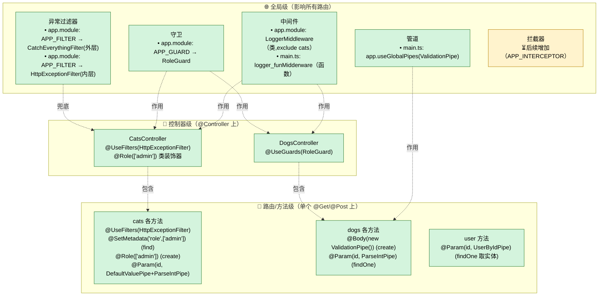
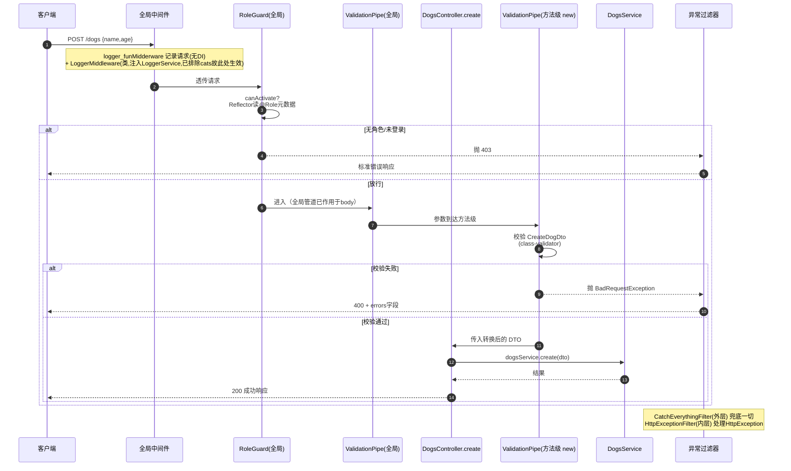
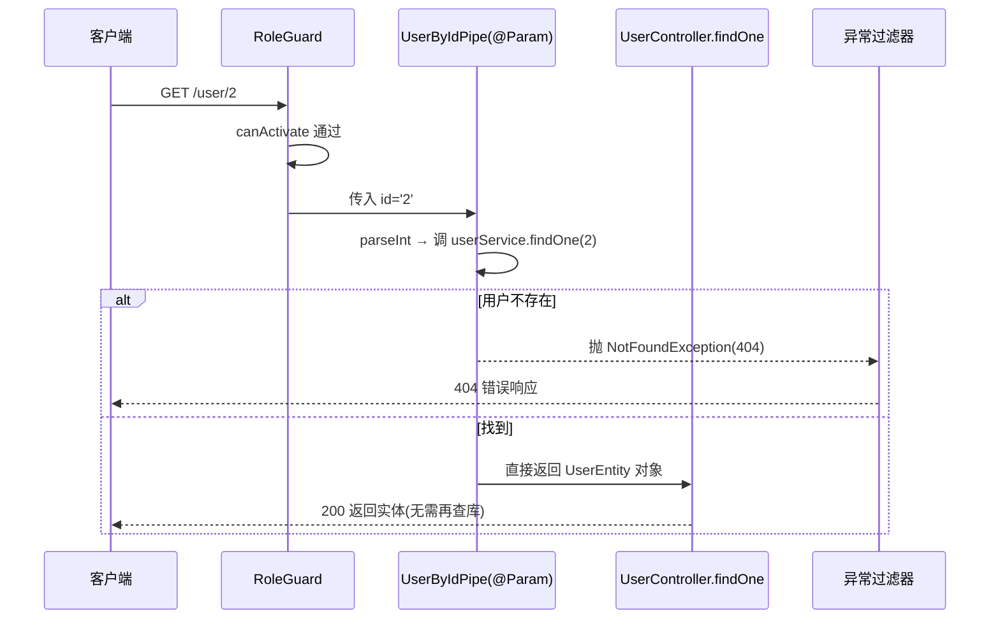

# NestJS 学习架构图（可随学习进度更新）

> 本图基于本项目**真实代码**绘制，用于梳理 NestJS 核心机制的**挂载位置**与**一次请求的真实流转**。
> 图中 🟡 标注「后续增加」的部分 = 尚未实现、已规划要学习的机制（拦截器）。
> 后续学习到新机制时，只需在对应 Mermaid 源码里增删节点，图自动随文本更新。

---

## 一、机制挂载位置图（每个机制注册在哪一层）

下图按「全局 → 控制器 → 路由/方法」三级，标出本项目里每个机制**具体挂在哪**。

> 说明：
> - **类中间件** `LoggerMiddleware` 通过 `consumer.apply().exclude(cats).forRoutes('*')` 全局生效但排除 cats；
> - **函数式中间件** `logger_funMidderware` 通过 `app.use()` 全局生效（无 DI、无 exclude）；
> - **RoleGuard** 同时存在于「全局 APP_GUARD」与「DogsController 控制器级」，cats 则用 `@Role`/`@SetMetadata` 元数据在方法级控制；
> - **ValidationPipe** 全局注册 + dogs `create` 方法级 `new ValidationPipe()` 双重演示；
> - **拦截器**尚未实现，预留全局 `APP_INTERCEPTOR` 位置。

---

## 二、一次真实请求的完整流转（POST /dogs）

下图细化一次请求经过的所有节点、参数转换、以及异常分支。

### 对照：带管道的 GET /user/:id（取实体）

---

## 三、机制之间的关系与联系

| 机制 | 作用 | 能否 DI | 本项目挂载位置 | 状态 |
| --- | --- | --- | --- | --- |
| 中间件 | 通用请求处理（日志） | 类可 | 全局（app.use / consumer.apply） | ★已实现 |
| 守卫 | 鉴权/权限 | 可 | 全局 APP_GUARD + 控制器/方法级 | ★已实现 |
| 拦截器 | 转换/缓存/日志/超时 | 可 | ⏳预留 APP_INTERCEPTOR | ⏳后续增加 |
| 管道 | 参数转换/校验 | 可 | 全局 + 方法级（@Param/@Body） | ★已实现 |
| 异常过滤器 | 统一错误响应 | 可 | 全局 APP_FILTER（双层） | ★已实现 |

---

## 四、如何随学习进度更新本图

1. **实现拦截器**：把「一、机制挂载位置图」里 `G_IC` 节点换成真实实现，样式 `pending`→`done`；在「三、关系表」改状态。
2. **新增模块/Service**：在对应控制器级/方法级子图补充节点并连线。
3. **新增全局注册**：在「全局级」子图加节点，用 `-.作用.->` 连到受影响控制器。
4. **新增异常类型**：在时序图 `EF` 分支补充即可。

> 本文件使用 Mermaid 语法，VS Code / GitHub / GitLab 均可直接渲染，修改文本即更新图。

