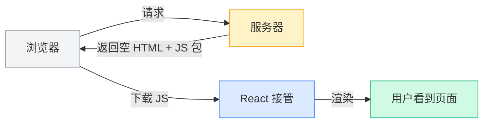
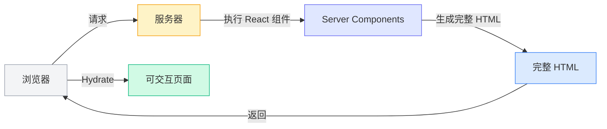
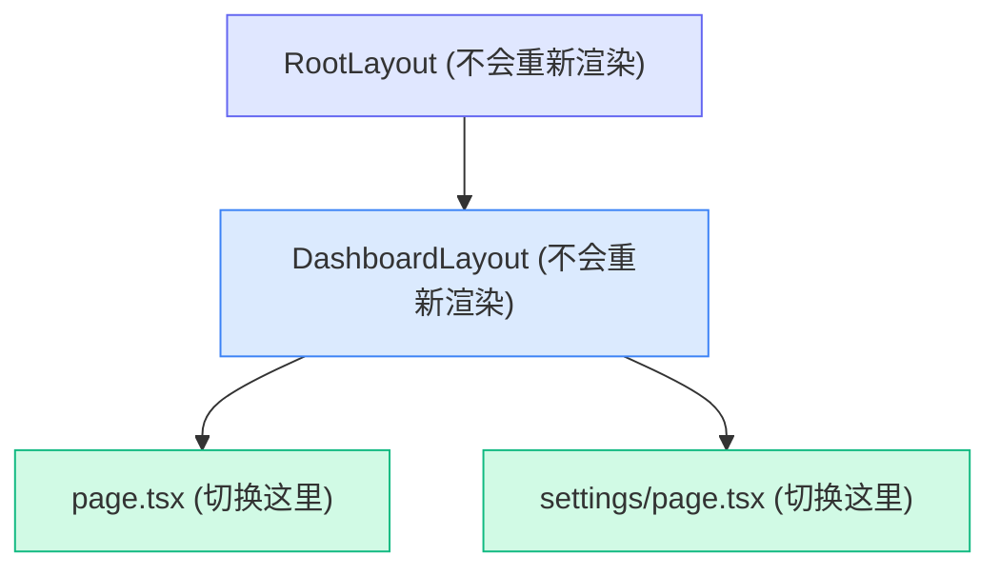
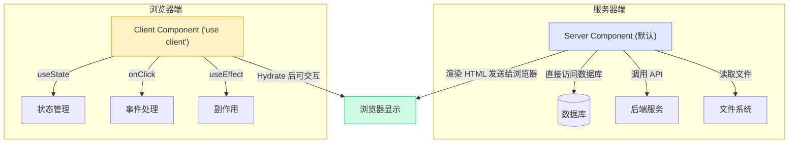
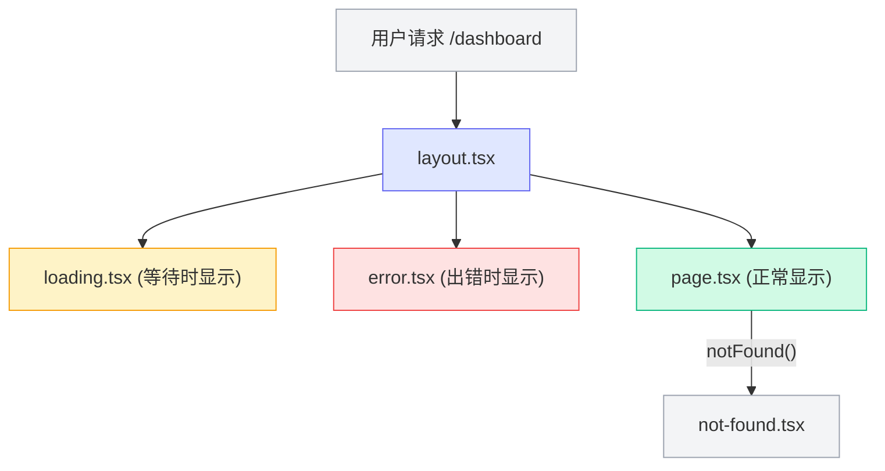

# 给 React 开发者的 Next.js 指南

> 本文面向有 React + react-router 经验的开发者，帮你快速建立 Next.js 的心智模型。
> 以 EdgeMind Studio 项目 (Next.js 16 + App Router) 为实例。

## 目录

- [心智模型的转变](#心智模型的转变)
- [路由：从 react-router 到文件系统路由](#路由从-react-router-到文件系统路由)
- [布局 Layout：react-router 的 Outlet 升级版](#布局-layout-react-router-的-outlet-升级版)
- [Server Components vs Client Components](#server-components-vs-client-components)
- [数据获取：告别 useEffect](#数据获取告别-useeffect)
- [Loading、Error、Not Found：内置的 UI 状态](#loadingerrornot-found内置的-ui-状态)
- [Server Actions：表单不再需要 API 路由](#server-actions表单不再需要-api-路由)
- [渲染策略：SSR、SSG、ISR](#渲染策略ssrssgisrisr)
- [Metadata 与 SEO](#metadata-与-seo)
- [Middleware：请求级别的拦截器](#middleware请求级别的拦截器)
- [缓存体系：Next.js 最复杂的部分](#缓存体系nextjs-最复杂的部分)
- [常见陷阱与对照表](#常见陷阱与对照表)

---

## 心智模型的转变

你过去写的 React 应用大概是这样的：



**React SPA 模式**：服务器返回一个空的 `<div id="root">`，所有渲染逻辑都在浏览器执行。

Next.js 不一样：



**Next.js 模式**：服务器先运行你的 React 组件，生成完整 HTML 发送给浏览器。用户**立刻**看到内容，然后 JS 加载完成后页面变得可交互。

**核心差异**：你的组件不再只在浏览器里运行，它们**默认在服务器上运行**。

---

## 路由：从 react-router 到文件系统路由

### react-router 的方式

你可能习惯这样定义路由：

```tsx
// react-router: 手动定义路由映射
<Routes>
  <Route path="/" element={<Home />} />
  <Route path="/dashboard" element={<Dashboard />} />
  <Route path="/settings" element={<Settings />} />
  <Route path="/users/:id" element={<UserProfile />} />
</Routes>
```

### Next.js 的方式

在 Next.js 中，**文件结构就是路由结构**。不需要写任何路由配置：

```
src/app/
├── page.tsx              →  /
├── dashboard/
│   └── page.tsx          →  /dashboard
├── settings/
│   └── page.tsx          →  /settings
└── users/
    └── [id]/
        └── page.tsx      →  /users/123, /users/456, ...
```

**核心规则**：

| 概念 | react-router | Next.js App Router |
|------|-------------|-------------------|
| 路由定义 | `<Route path="/about">` | 创建 `app/about/page.tsx` 文件 |
| 动态参数 | `<Route path="/users/:id">` | 创建 `app/users/[id]/page.tsx` 目录 |
| 嵌套路由 | `<Route>` 嵌套 + `<Outlet>` | 文件夹嵌套 + `layout.tsx` |
| 导航 | `<Link to="/about">` | `<Link href="/about">` |
| 编程式导航 | `useNavigate()` | `useRouter()` from `next/navigation` |
| 读取参数 | `useParams()` | `params` prop (异步，需 `await`) |
| 查询参数 | `useSearchParams()` | `searchParams` prop 或 `useSearchParams()` |

### 动态路由参数

```tsx
// react-router
function UserProfile() {
  const { id } = useParams();
  return <div>User {id}</div>;
}

// Next.js (App Router) —— 注意 params 是异步的
export default async function UserProfile({
  params,
}: {
  params: Promise<{ id: string }>;
}) {
  const { id } = await params;
  return <div>User {id}</div>;
}
```

### 导航

```tsx
// react-router
import { Link, useNavigate } from "react-router-dom";

function Nav() {
  const navigate = useNavigate();
  return (
    <>
      <Link to="/dashboard">Dashboard</Link>
      <button onClick={() => navigate("/settings")}>Go</button>
    </>
  );
}

// Next.js
import Link from "next/link";
import { useRouter } from "next/navigation";

function Nav() {
  const router = useRouter();
  return (
    <>
      <Link href="/dashboard">Dashboard</Link>
      <button onClick={() => router.push("/settings")}>Go</button>
    </>
  );
}
```

### 特殊路由模式

Next.js 有一些 react-router 没有的文件夹命名约定：

```
src/app/
├── (marketing)/          # 路由组 —— 不影响 URL，只用于组织代码和共享布局
│   ├── layout.tsx        # 这个布局只应用于组内页面
│   ├── about/page.tsx    →  /about
│   └── pricing/page.tsx  →  /pricing
│
├── (dashboard)/
│   ├── layout.tsx        # dashboard 页面共享的侧边栏布局
│   ├── overview/page.tsx →  /overview
│   └── analytics/page.tsx→  /analytics
│
├── @modal/               # 并行路由 —— 同一页面中同时渲染多个"插槽"
│   └── login/page.tsx
│
└── api/                  # API 路由 —— 后端接口
    └── users/route.ts    →  GET/POST /api/users
```

- **`(folder)`** — 路由组：括号内的名字不会出现在 URL 中，纯粹用于组织代码或共享布局
- **`[folder]`** — 动态段：匹配一个 URL 片段，如 `/users/123`
- **`[...folder]`** — 捕获所有：匹配剩余的所有 URL 片段，如 `/docs/a/b/c`
- **`@folder`** — 并行路由：在同一个布局中同时渲染多个页面

> 我们项目中的 `[lang]` 就是一个动态段，用来做国际化路由：`/en/dashboard`、`/zh/dashboard`。

---

## 布局 Layout：react-router 的 Outlet 升级版

### react-router 中的嵌套布局

```tsx
// react-router: 用 Outlet 实现嵌套布局
function DashboardLayout() {
  return (
    <div className="flex">
      <Sidebar />
      <main>
        <Outlet /> {/* 子路由在这里渲染 */}
      </main>
    </div>
  );
}

// 路由配置
<Route path="/dashboard" element={<DashboardLayout />}>
  <Route index element={<Overview />} />
  <Route path="settings" element={<Settings />} />
</Route>
```

### Next.js 中的 Layout

Next.js 用 `layout.tsx` 文件实现同样的效果，但更强大：

```
src/app/
└── dashboard/
    ├── layout.tsx      # Dashboard 的布局（侧边栏等）
    ├── page.tsx        # /dashboard
    └── settings/
        └── page.tsx    # /dashboard/settings
```

```tsx
// src/app/dashboard/layout.tsx
export default function DashboardLayout({
  children,  // 等价于 react-router 的 <Outlet />
}: {
  children: React.ReactNode;
}) {
  return (
    <div className="flex">
      <Sidebar />
      <main>{children}</main>
    </div>
  );
}
```

### Layout 的核心优势：状态保持

**react-router 的痛点**：在路由之间导航时，布局组件会重新挂载（除非你特别处理）。

**Next.js 的 Layout**：在同级页面间导航时**不会重新渲染**。比如从 `/dashboard` 切换到 `/dashboard/settings`，`DashboardLayout` 里的 `Sidebar` 组件保持不变，不会闪烁，不会丢失状态。



> 我们项目的根布局在 `src/app/[lang]/layout.tsx`，它负责注入所有 Provider（ThemeProvider、LinguiProvider、QueryProvider 等），这些 Provider 在页面切换时保持不变。

---

## Server Components vs Client Components

**这是 Next.js 中最重要的概念。** 理解它就理解了 Next.js 的一半。

### 两种组件



### 判断标准

```tsx
// ✅ Server Component（默认，不需要任何标记）
// 可以：async/await、直接查数据库、访问文件系统、使用密钥
// 不可以：useState、useEffect、onClick、浏览器 API
export default async function UserList() {
  const users = await db.query("SELECT * FROM users"); // 直接查数据库！
  return (
    <ul>
      {users.map((u) => (
        <li key={u.id}>{u.name}</li>
      ))}
    </ul>
  );
}
```

```tsx
// ✅ Client Component（第一行加 "use client"）
// 可以：useState、useEffect、onClick、浏览器 API
// 不可以：直接查数据库、使用服务器端密钥
"use client";

import { useState } from "react";

export default function Counter() {
  const [count, setCount] = useState(0);
  return <button onClick={() => setCount(count + 1)}>Count: {count}</button>;
}
```

### 决策速查表

问自己这个问题：**这个组件需要交互吗？**

| 需要什么？ | 用哪个？ |
|-----------|---------|
| 获取数据（数据库、API） | Server Component |
| 静态展示内容 | Server Component |
| `useState`、`useReducer` | Client Component |
| `useEffect`、`useRef` | Client Component |
| `onClick`、`onChange` 等事件 | Client Component |
| 浏览器 API（localStorage、window） | Client Component |
| 第三方状态库（Zustand、Redux） | Client Component |

### 组合模式：Server 包裹 Client

常见的模式是让 Server Component 获取数据，Client Component 处理交互：

```tsx
// Server Component —— 获取数据
export default async function UserPage() {
  const user = await fetchUser();  // 服务端获取数据
  return <UserProfile user={user} />;  // 传给 Client Component
}
```

```tsx
// Client Component —— 处理交互
"use client";

export function UserProfile({ user }: { user: User }) {
  const [editing, setEditing] = useState(false);
  return (
    <div>
      <h1>{user.name}</h1>
      <button onClick={() => setEditing(true)}>Edit</button>
      {editing && <EditForm user={user} />}
    </div>
  );
}
```

### 常见误区

**误区："use client" 意味着只在浏览器运行。**

事实：Client Component 在服务端也会运行一次（用于生成初始 HTML），然后在浏览器再运行一次（Hydrate）。`"use client"` 的真正含义是**"这个组件需要被包含在 JS 包中发送给浏览器"**。

**误区：应该尽量让所有组件都是 Server Component。**

事实：不需要强迫症。需要交互就加 `"use client"`，不需要就不加。两种组件各有用途。

---

## 数据获取：告别 useEffect

### React SPA 的老方法

```tsx
// ❌ 你以前可能这样写
function UserList() {
  const [users, setUsers] = useState([]);
  const [loading, setLoading] = useState(true);
  const [error, setError] = useState(null);

  useEffect(() => {
    fetch("/api/users")
      .then((res) => res.json())
      .then((data) => setUsers(data))
      .catch((err) => setError(err))
      .finally(() => setLoading(false));
  }, []);

  if (loading) return <Spinner />;
  if (error) return <ErrorMessage />;
  return <ul>{users.map(/* ... */)}</ul>;
}
```

这段代码有很多问题：竞态条件、没有缓存、加载闪烁、瀑布请求……

### Next.js 的方式：直接 async/await

```tsx
// ✅ Server Component 中直接获取数据
export default async function UserList() {
  const res = await fetch("https://api.example.com/users");
  const users = await res.json();

  return (
    <ul>
      {users.map((user) => (
        <li key={user.id}>{user.name}</li>
      ))}
    </ul>
  );
}
```

没有 `useState`，没有 `useEffect`，没有 loading 状态管理。代码量减少一半以上。

### 那 Client Component 怎么获取数据？

在 Client Component 中，推荐用 **TanStack Query**（我们项目已集成）：

```tsx
"use client";

import { useQuery } from "@tanstack/react-query";

export function UserList() {
  const { data: users, isLoading, error } = useQuery({
    queryKey: ["users"],
    queryFn: () => fetch("/api/users").then((res) => res.json()),
  });

  if (isLoading) return <Spinner />;
  if (error) return <ErrorMessage />;
  return <ul>{users.map(/* ... */)}</ul>;
}
```

TanStack Query 自动处理了缓存、去重、重试、后台刷新等问题。

### 数据获取策略对照

| 场景 | 推荐方式 |
|------|---------|
| 页面初始数据 | Server Component + async/await |
| 需要用户交互后获取 | Client Component + TanStack Query |
| 需要实时更新 | Client Component + TanStack Query (轮询/WebSocket) |
| 表单提交 | Server Actions |

---

## Loading、Error、Not Found：内置的 UI 状态

在 react-router 中，你需要自己管理每个页面的加载和错误状态。Next.js 通过**特殊文件名**内置了这些：

```
src/app/dashboard/
├── page.tsx          # 页面内容
├── loading.tsx       # 加载状态（自动包裹 Suspense）
├── error.tsx         # 错误边界
└── not-found.tsx     # 404 状态
```

### loading.tsx

```tsx
// src/app/dashboard/loading.tsx
// 当 page.tsx 在获取数据时，自动显示这个组件
export default function Loading() {
  return <div className="animate-pulse">Loading dashboard...</div>;
}
```

Next.js 自动把你的 `page.tsx` 包裹在 `<Suspense fallback={<Loading />}>` 中。你不需要手写 Suspense。

### error.tsx

```tsx
// src/app/dashboard/error.tsx
"use client"; // error.tsx 必须是 Client Component

export default function Error({
  error,
  reset,
}: {
  error: Error;
  reset: () => void;
}) {
  return (
    <div>
      <h2>Something went wrong!</h2>
      <button onClick={reset}>Try again</button>
    </div>
  );
}
```

### not-found.tsx

```tsx
// src/app/dashboard/not-found.tsx
export default function NotFound() {
  return <div>Page not found</div>;
}
```

在 page 或 layout 中调用 `notFound()` 函数即可触发：

```tsx
import { notFound } from "next/navigation";

export default async function UserPage({ params }) {
  const { id } = await params;
  const user = await fetchUser(id);
  if (!user) notFound(); // 触发 not-found.tsx
  return <UserProfile user={user} />;
}
```

### 这些特殊文件如何协作



所有这些文件都是**可选的**，只在你需要的目录下创建即可。

---

## Server Actions：表单不再需要 API 路由

### 传统方式

```tsx
// ❌ 老方法：前端 fetch 调后端 API
// 1. 先写 API 路由
// app/api/users/route.ts
export async function POST(req: Request) {
  const data = await req.json();
  await db.insert(data);
  return Response.json({ success: true });
}

// 2. 再在前端调用
function CreateUserForm() {
  const handleSubmit = async (e) => {
    e.preventDefault();
    await fetch("/api/users", {
      method: "POST",
      body: JSON.stringify(formData),
    });
  };
  return <form onSubmit={handleSubmit}>...</form>;
}
```

### Server Actions

```tsx
// ✅ Server Action：直接调服务器函数，不需要 API 路由
// src/app/dashboard/actions.ts
"use server";

export async function createUser(formData: FormData) {
  const name = formData.get("name") as string;
  const email = formData.get("email") as string;

  await db.insert({ name, email });

  revalidatePath("/dashboard"); // 让页面重新获取最新数据
}
```

```tsx
// 在组件中使用
import { createUser } from "./actions";

export default function CreateUserForm() {
  return (
    <form action={createUser}>
      <input name="name" placeholder="Name" />
      <input name="email" placeholder="Email" />
      <button type="submit">Create</button>
    </form>
  );
}
```

**注意 `"use server"` 标记** —— 这告诉 Next.js 这个函数只在服务器端运行。当表单提交时，Next.js 自动将 FormData 序列化发送到服务器，执行函数，然后返回结果。

### 配合 React Hook Form

我们项目使用 React Hook Form + Zod，可以结合 Server Actions：

```tsx
"use client";

import { useForm } from "react-hook-form";
import { zodResolver } from "@hookform/resolvers/zod";
import { z } from "zod";
import { createUser } from "./actions";

const schema = z.object({
  name: z.string().min(1, "Name is required"),
  email: z.string().email("Invalid email"),
});

export function CreateUserForm() {
  const form = useForm({
    resolver: zodResolver(schema),
  });

  async function onSubmit(data: z.infer<typeof schema>) {
    const formData = new FormData();
    formData.append("name", data.name);
    formData.append("email", data.email);
    await createUser(formData);
  }

  return (
    <form onSubmit={form.handleSubmit(onSubmit)}>
      <input {...form.register("name")} />
      <input {...form.register("email")} />
      <button type="submit">Create</button>
    </form>
  );
}
```

---

## 渲染策略：SSR、SSG、ISR

React SPA 只有一种渲染方式：CSR (Client-Side Rendering)。Next.js 有多种：

```mermaid
graph TB
    subgraph SSG["SSG (Static Site Generation)"]
        direction LR
        Build1["构建时"] -->|生成 HTML| Static1["静态文件"]
        Static1 -->|直接返回| User1["用户"]
    end

    subgraph SSR["SSR (Server-Side Rendering)"]
        direction LR
        Req2["每次请求"] -->|运行组件| Server2["服务器"]
        Server2 -->|生成 HTML| User2["用户"]
    end

    subgraph ISR["ISR (Incremental Static Regeneration)"]
        direction LR
        First3["首次请求"] -->|返回缓存| Cache3["缓存 HTML"]
        Cache3 -->|过期后| Regen3["后台重新生成"]
    end

    style SSG fill:#d1fae5,stroke:#10b981
    style SSR fill:#dbeafe,stroke:#3b82f6
    style ISR fill:#fef3c7,stroke:#f59e0b
```



### 你怎么控制渲染策略？

不需要显式配置，Next.js 根据你的**代码行为**自动决定：

```tsx
// 自动 SSG —— 构建时生成，完全静态
export default function About() {
  return <h1>About us</h1>;  // 没有动态数据
}

// 自动 SSR —— 每次请求时渲染
export default async function Dashboard() {
  const data = await fetch("https://api.example.com/stats", {
    cache: "no-store",  // 明确不缓存 → SSR
  });
  return <Stats data={data} />;
}

// ISR —— 静态生成，但定期刷新
export default async function Blog() {
  const posts = await fetch("https://api.example.com/posts", {
    next: { revalidate: 60 },  // 每 60 秒重新验证
  });
  return <PostList posts={posts} />;
}
```

### 让页面动态化的触发条件

以下任一条件会让页面变成 SSR（每次请求渲染）：

- 使用 `cookies()` 或 `headers()`
- 使用 `searchParams` prop
- fetch 中设置 `cache: "no-store"`
- 在路由段配置中设置 `export const dynamic = "force-dynamic"`

---

## Metadata 与 SEO

React SPA 的大痛点：SEO 困难。Next.js 原生支持。

```tsx
// 静态 metadata
export const metadata: Metadata = {
  title: "Dashboard",
  description: "View your analytics",
};

// 动态 metadata
export async function generateMetadata({ params }): Promise<Metadata> {
  const { id } = await params;
  const user = await fetchUser(id);
  return {
    title: `${user.name}'s Profile`,
    description: user.bio,
  };
}

export default function Page() {
  return <div>...</div>;
}
```

不需要 `react-helmet` 或 `react-helmet-async`。

---

## Middleware：请求级别的拦截器

Middleware 在**每个请求到达页面之前**运行，类似于 Express 的中间件：

```tsx
// src/middleware.ts（只能放在 src/ 或项目根目录）
import { NextResponse } from "next/server";
import type { NextRequest } from "next/server";

export function middleware(request: NextRequest) {
  // 例：检查用户是否登录
  const token = request.cookies.get("token");

  if (!token && request.nextUrl.pathname.startsWith("/dashboard")) {
    return NextResponse.redirect(new URL("/login", request.url));
  }

  return NextResponse.next();
}

// 配置哪些路径需要经过 middleware
export const config = {
  matcher: ["/dashboard/:path*", "/settings/:path*"],
};
```

常见用途：

- 认证检查（未登录跳转登录页）
- 语言检测和重定向（我们项目用 proxy 代替了 middleware 做 i18n）
- A/B 测试
- 地理位置路由

---

## 缓存体系：Next.js 最复杂的部分

> 这是很多人被 Next.js 搞晕的部分，简单说明核心概念就好。

Next.js 有多层缓存：

| 缓存层 | 是什么 | 怎么失效 |
|-------|-------|---------|
| **Request Memoization** | 同一次渲染中，相同的 fetch 请求自动去重 | 自动，请求结束后 |
| **Data Cache** | fetch 结果缓存在服务端 | `revalidatePath()`、`revalidateTag()` |
| **Full Route Cache** | 整个页面的 HTML + RSC Payload 缓存 | `revalidatePath()`、重新部署 |
| **Router Cache** | 浏览器端缓存已访问的路由 | `router.refresh()`、过期、导航 |

日常开发中你最常用的是 **Data Cache**：

```tsx
// 永久缓存（默认行为）
await fetch("https://api.example.com/data");

// 不缓存
await fetch("https://api.example.com/data", { cache: "no-store" });

// 定时重新验证
await fetch("https://api.example.com/data", {
  next: { revalidate: 3600 }, // 1 小时
});
```

手动失效缓存（通常在 Server Action 中）：

```tsx
"use server";

import { revalidatePath, revalidateTag } from "next/cache";

export async function updateUser() {
  await db.update(/* ... */);

  revalidatePath("/dashboard");         // 失效整个路径的缓存
  revalidateTag("user-data");           // 失效带这个 tag 的所有 fetch 缓存
}
```

---

## 常见陷阱与对照表

### 1. "use client" 的传染性

`"use client"` 会向下传播：一旦某个文件标记了 `"use client"`，它导入的所有子模块也自动成为 Client Component。

```
ServerComponent
├── ClientComponent ("use client")  ← 边界在这里
│   ├── ChildA  ← 自动变成 Client
│   └── ChildB  ← 自动变成 Client
```

**但反过来不行**：Client Component 不能直接 import Server Component。如果需要在 Client Component 内部渲染 Server Component，用 `children` prop 传递：

```tsx
// ✅ 正确方式
<ClientComponent>
  <ServerComponent />  {/* 通过 children 传入 */}
</ClientComponent>
```

### 2. `useRouter` 来源不同

```tsx
// ❌ 错误：从 next/router 导入（这是 Pages Router 的）
import { useRouter } from "next/router";

// ✅ 正确：从 next/navigation 导入（App Router）
import { useRouter } from "next/navigation";
```

### 3. 环境变量

```bash
# 只在服务端可用
DATABASE_URL=postgres://...
API_SECRET=sk-xxx

# 浏览器也能访问（注意前缀）
NEXT_PUBLIC_API_URL=https://api.example.com
```

只有 `NEXT_PUBLIC_` 前缀的环境变量才会打包到客户端。

### 4. 完整对照表

| 你在 React SPA 中用的 | Next.js 中的替代方案 |
|---------------------|-------------------|
| `react-router-dom` | App Router (文件系统路由) |
| `<BrowserRouter>` | 不需要，内置 |
| `<Route path="...">` | 创建对应目录和 `page.tsx` |
| `<Outlet />` | `layout.tsx` 中的 `{children}` |
| `useNavigate()` | `useRouter()` from `next/navigation` |
| `useParams()` | `params` prop (async) |
| `useSearchParams()` | `searchParams` prop 或 `useSearchParams()` |
| `<Helmet>` / `react-helmet` | `export const metadata` 或 `generateMetadata()` |
| `useEffect` + `fetch` | Server Component async/await 或 TanStack Query |
| 手写 loading/error 状态 | `loading.tsx` / `error.tsx` |
| API 路由 (Express) | `app/api/*/route.ts` 或 Server Actions |
| `react-helmet-async` | 内置 Metadata API |
| Webpack | Turbopack (内置，更快) |
| `.env` 全部可用 | 只有 `NEXT_PUBLIC_*` 在客户端可用 |

---

> 更多细节请参考 [Next.js 官方文档](https://nextjs.org/docs) 和项目中的 [国际化指南](./nextjs-i18n-guide.md)。
