# Next.js 国际化 (i18n) 完全指南

> 本文以 EdgeMind Studio 前端项目为实例，深入讲解 Next.js 16 + Lingui 的国际化方案。
> 适合对 Next.js 不了解的读者，从零开始理解整个 i18n 体系。

## 目录

- [什么是国际化 (i18n)](#什么是国际化-i18n)
- [技术选型：为什么选择 Lingui](#技术选型为什么选择-lingui)
- [整体架构概览](#整体架构概览)
- [第一层：URL 路由 —— 用户如何访问不同语言](#第一层url-路由--用户如何访问不同语言)
- [第二层：Proxy 拦截 —— 自动检测用户语言](#第二层proxy-拦截--自动检测用户语言)
- [第三层：翻译加载 —— 服务端如何准备翻译数据](#第三层翻译加载--服务端如何准备翻译数据)
- [第四层：Provider 注入 —— 翻译如何传递给组件](#第四层provider-注入--翻译如何传递给组件)
- [第五层：组件中使用翻译](#第五层组件中使用翻译)
- [翻译工作流：从代码到 .po 文件](#翻译工作流从代码到-po-文件)
- [构建配置：SWC 插件与 Turbopack](#构建配置swc-插件与-turbopack)
- [项目文件结构总览](#项目文件结构总览)
- [完整请求生命周期](#完整请求生命周期)
- [常见问题 FAQ](#常见问题-faq)

---

## 什么是国际化 (i18n)

国际化 (Internationalization，缩写为 **i18n**，因为 i 和 n 之间有 18 个字母) 是让一个应用支持多种语言和地区的过程。

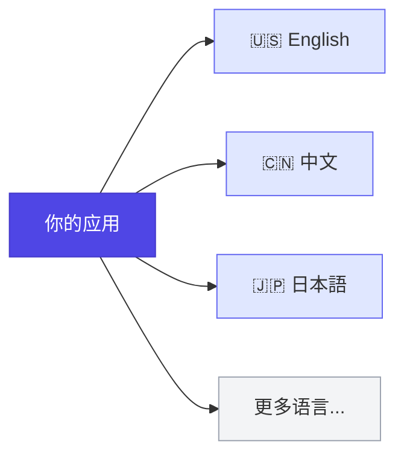

核心思想很简单：**代码里不写死任何文字，而是用"翻译键"代替，运行时根据用户语言加载对应的翻译文本。**

比如：

```tsx
// ❌ 硬编码文字 —— 只能显示英文
<h1>Welcome</h1>

// ✅ 使用翻译键 —— 根据语言自动切换
<h1>{t`Welcome`}</h1>
// 英文用户看到: Welcome
// 中文用户看到: 欢迎
```

---

## 技术选型：为什么选择 Lingui

Next.js 生态中常见的 i18n 方案对比：

| 特性 | **Lingui** | next-intl | react-i18next |
|------|-----------|-----------|---------------|
| 翻译格式 | `.po` (Gettext 标准) | JSON | JSON |
| 宏编译 (零运行时开销) | ✅ SWC 插件 | ❌ | ❌ |
| Server Components 支持 | ✅ | ✅ | 部分 |
| 消息提取 (自动扫描代码) | ✅ CLI 内置 | ❌ 需手动 | ❌ 需手动 |
| 复数/性别等 ICU 语法 | ✅ | ✅ | ✅ |
| 包体积 | 极小 (宏编译后) | 小 | 中等 |

本项目选择 **Lingui** 的理由：

1. **SWC 编译时宏** —— `t`、`Trans` 等宏在构建时被编译为高效代码，零运行时解析开销
2. **自动消息提取** —— 运行 `pnpm extract` 即可扫描代码自动生成翻译文件
3. **`.po` 格式** —— 翻译行业标准，专业翻译工具 (Crowdin、Transifex) 原生支持
4. **Server Components 完美支持** —— 服务端/客户端组件有各自的 API，互不干扰

---

## 整体架构概览

先看全局：一个国际化请求从用户浏览器到页面渲染的完整流程。

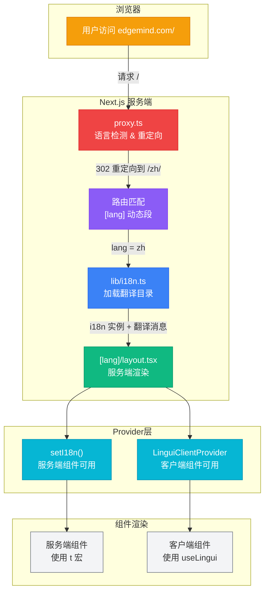

下面我们逐层深入讲解。

---

## 第一层：URL 路由 —— 用户如何访问不同语言

Next.js 使用**基于文件系统的路由**。文件夹名就是 URL 路径段。

### 什么是动态路由段 `[lang]`

方括号 `[lang]` 表示这是一个**动态参数**，可以匹配任意值：

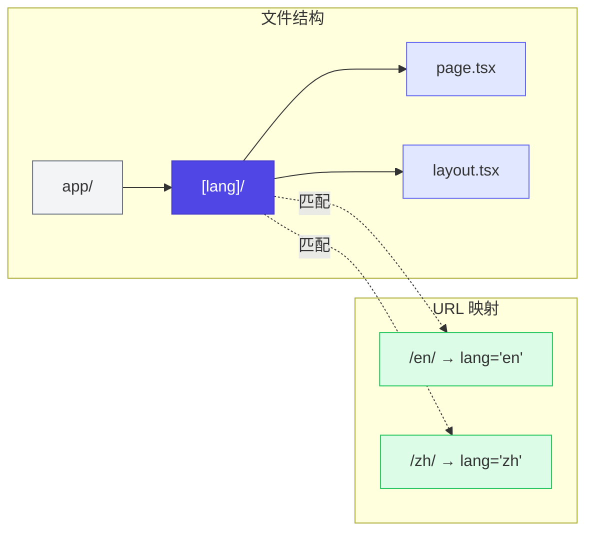

当用户访问 `/en/about` 时，Next.js 会把 `lang` 参数设为 `"en"`，并传给页面组件。

### generateStaticParams：构建时预生成

为了在构建时生成所有语言的静态页面，我们在 `layout.tsx` 中定义 `generateStaticParams`：

```typescript
// src/app/[lang]/layout.tsx
import linguiConfig from "../../../lingui.config";

export function generateStaticParams() {
  return linguiConfig.locales.map((lang) => ({ lang }));
}
// 返回: [{ lang: "en" }, { lang: "zh" }]
```

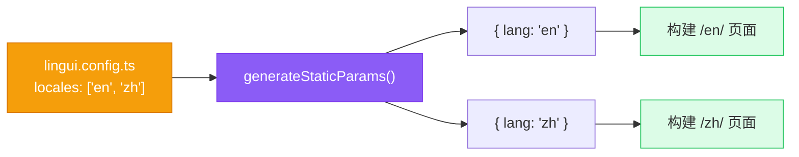

这意味着 Next.js 在 `build` 时就会为每种语言生成独立的 HTML，实现静态站点生成 (SSG)。

### Lingui 配置：定义支持的语言

所有语言配置集中在 `lingui.config.ts`：

```typescript
// lingui.config.ts
import { defineConfig } from "@lingui/cli";

export default defineConfig({
  sourceLocale: "en",        // 源语言（开发时写的语言）
  locales: ["en", "zh"],     // 所有支持的语言
  catalogs: [
    {
      path: "<rootDir>/src/locales/{locale}/messages",  // 翻译文件位置
      include: ["src"],                                  // 扫描范围
    },
  ],
});
```

这个配置文件是整个 i18n 系统的**单一真相来源 (Single Source of Truth)**，proxy、layout、构建工具都从这里读取语言列表。

---

## 第二层：Proxy 拦截 —— 自动检测用户语言

当用户直接访问 `edgemind.com/`（没有语言前缀）时，我们需要**自动检测用户语言**并重定向。

这就是 `proxy.ts` 的职责（在 Next.js 16 中，原来的 `middleware.ts` 已重命名为 `proxy.ts`）。

### Proxy 工作流程

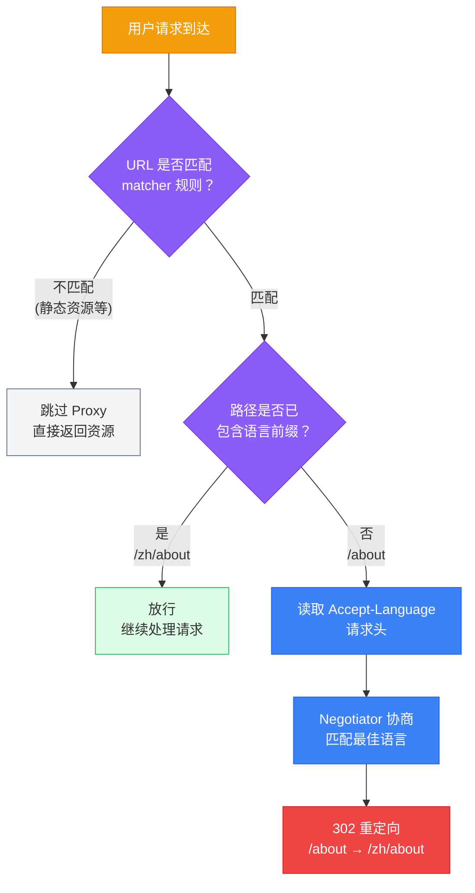

### 源码解读

```typescript
// src/proxy.ts
import Negotiator from "negotiator";
import { type NextRequest, NextResponse } from "next/server";
import linguiConfig from "../lingui.config";

const { locales } = linguiConfig;  // ["en", "zh"]

export function proxy(request: NextRequest) {
  const { pathname } = request.nextUrl;

  // 第 1 步：检查路径是否已包含语言前缀
  const pathnameHasLocale = locales.some(
    (locale) =>
      pathname.startsWith(`/${locale}/`) || pathname === `/${locale}`,
  );
  if (pathnameHasLocale) return;  // 已有语言前缀，放行

  // 第 2 步：从请求头中协商最佳语言
  const locale = getRequestLocale(request.headers);

  // 第 3 步：重定向到带语言前缀的路径
  request.nextUrl.pathname = `/${locale}${pathname}`;
  return NextResponse.redirect(request.nextUrl);
}
```

### 语言协商 (Language Negotiation)

浏览器在每个请求中都会发送 `Accept-Language` 头，告诉服务器用户偏好的语言：

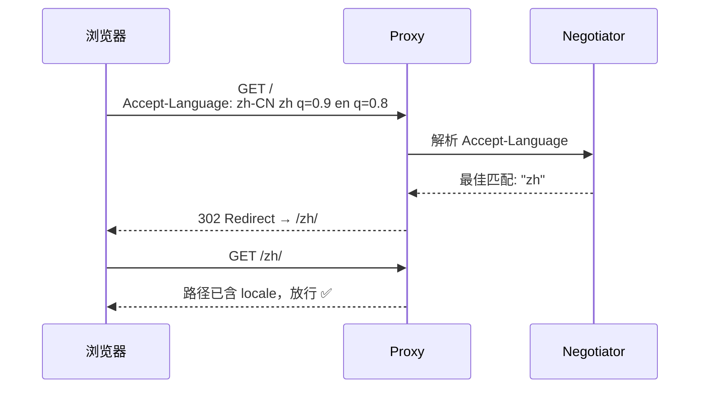

`Negotiator` 库将浏览器的语言偏好列表与我们支持的语言列表进行匹配，找出最佳匹配：

```typescript
function getRequestLocale(requestHeaders: Headers): string {
  const langHeader = requestHeaders.get("accept-language") || undefined;
  // 例如: "zh-CN,zh;q=0.9,en;q=0.8"

  const languages = new Negotiator({
    headers: { "accept-language": langHeader },
  }).languages(locales.slice());
  // 传入支持的 ["en", "zh"]，返回按优先级排序的匹配结果

  return languages[0] || locales[0] || "en";
  // 取最佳匹配，兜底为 "en"
}
```

### Matcher：哪些请求需要经过 Proxy

不是所有请求都需要语言检测。静态资源（CSS、JS、图片等）应该跳过：

```typescript
export const config = {
  matcher: [
    "/((?!_next/static|_next/image|favicon.ico|.*\\.(?:svg|png|jpg|jpeg|gif|webp)$).*)"
  ],
};
```

这个正则使用**负向前瞻**，意思是：匹配所有路径，**除了**以下几类：

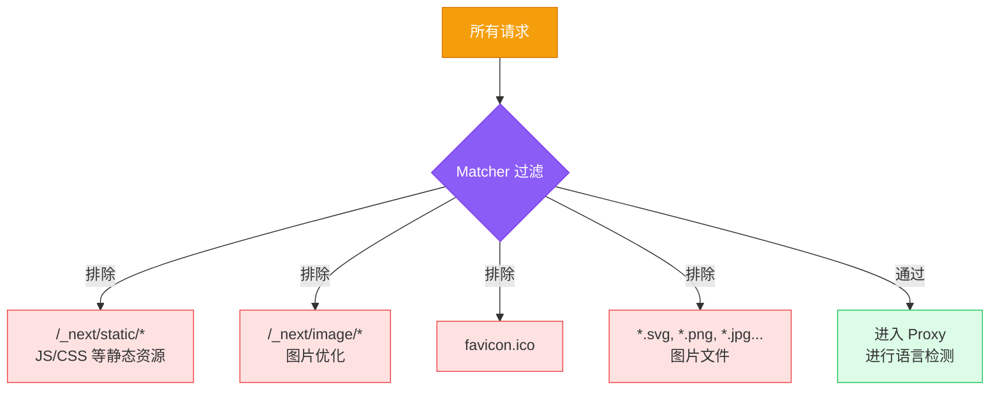

---

## 第三层：翻译加载 —— 服务端如何准备翻译数据

路由确定了语言参数 `lang` 后，下一步是加载对应语言的翻译内容。这由 `lib/i18n.ts` 负责。

### 核心机制：模块级预加载

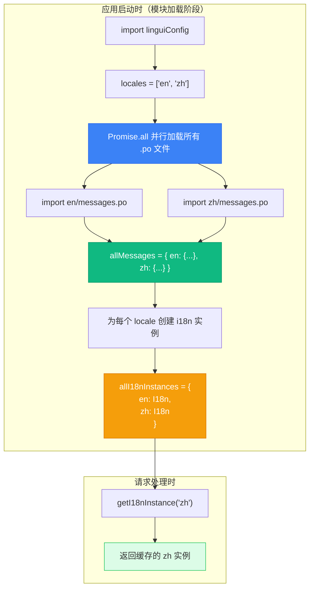

### 源码解读

```typescript
// src/lib/i18n.ts
import "server-only";  // 确保此模块只在服务端使用

import type { I18n, Messages } from "@lingui/core";
import { setupI18n } from "@lingui/core";
import linguiConfig from "../../lingui.config";

const { locales } = linguiConfig;

// 1. 加载某个语言的翻译目录
async function loadCatalog(locale: string): Promise<{ [k: string]: Messages }> {
  const { messages } = await import(`@/locales/${locale}/messages.po`);
  return { [locale]: messages };
}

// 2. 模块加载时，并行加载所有语言的翻译
const catalogs = await Promise.all(locales.map(loadCatalog));

// 3. 合并为一个大对象
const allMessages: Record<string, Messages> = {};
for (const catalog of catalogs) {
  Object.assign(allMessages, catalog);
}

// 4. 为每个语言创建独立的 i18n 实例并缓存
const allI18nInstances: Record<string, I18n> = {};
for (const locale of locales) {
  const messages = allMessages[locale] ?? {};
  allI18nInstances[locale] = setupI18n({
    locale,
    messages: { [locale]: messages },
  });
}

// 5. 导出获取函数
export function getI18nInstance(locale: string): I18n {
  if (!allI18nInstances[locale]) {
    console.warn(`No i18n instance found for locale "${locale}"`);
  }
  return allI18nInstances[locale] || allI18nInstances.en;  // 兜底英文
}
```

关键设计点：

- **`import "server-only"`** —— 保证此文件不会被打包到客户端，翻译数据不会增加客户端 JS 体积
- **顶层 `await`** —— 利用 ES 模块的 Top-Level Await，在模块首次加载时就完成所有翻译的预加载
- **实例缓存** —— 每个语言只创建一次 `i18n` 实例，后续请求复用，避免重复初始化

### .po 文件：翻译内容的载体

翻译内容存储在 `.po` 文件中（Gettext 格式，翻译行业标准）：

```
# src/locales/zh/messages.po

msgid "Welcome"
msgstr "欢迎"

msgid "Hello, {name}!"
msgstr "你好，{name}！"

msgid "{count, plural, one {# item} other {# items}}"
msgstr "{count, plural, other {# 个项目}}"
```

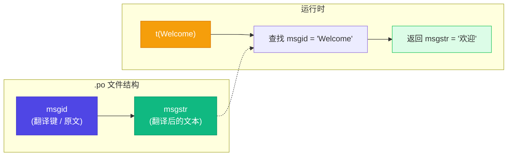

---

## 第四层：Provider 注入 —— 翻译如何传递给组件

Next.js 有两种组件：**Server Components**（服务端组件）和 **Client Components**（客户端组件）。它们使用翻译的方式不同，因此需要两条独立的注入路径。

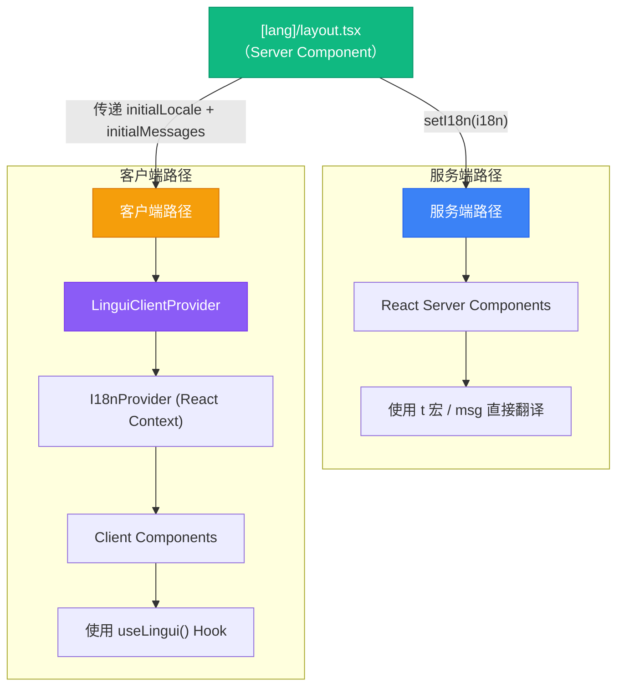

### Layout：桥梁角色

```typescript
// src/app/[lang]/layout.tsx
import { setI18n } from "@lingui/react/server";
import { getI18nInstance } from "@/lib/i18n";
import { LinguiClientProvider } from "@/components/providers/lingui-provider";

export default async function RootLayout({
  children,
  params,
}: {
  children: React.ReactNode;
  params: Promise<{ lang: string }>;
}) {
  const { lang } = await params;       // 从 URL 获取语言参数
  const i18n = getI18nInstance(lang);   // 获取对应语言的 i18n 实例

  setI18n(i18n);  // ① 为 Server Components 设置 i18n

  return (
    <html lang={lang}>  {/* ② 设置 HTML lang 属性，利于 SEO 和无障碍 */}
      <body>
        {/* ③ 为 Client Components 提供 i18n */}
        <LinguiClientProvider
          initialLocale={lang}
          initialMessages={i18n.messages}
        >
          {children}
        </LinguiClientProvider>
      </body>
    </html>
  );
}
```

### Client Provider：客户端 i18n 初始化

```typescript
// src/components/providers/lingui-provider.tsx
"use client";  // 标记为客户端组件

import { type Messages, setupI18n } from "@lingui/core";
import { I18nProvider } from "@lingui/react";
import { useState } from "react";

export function LinguiClientProvider({
  children,
  initialLocale,
  initialMessages,
}: {
  children: React.ReactNode;
  initialLocale: string;
  initialMessages: Messages;
}) {
  // 用 useState 确保只初始化一次，避免重复创建
  const [i18n] = useState(() => {
    return setupI18n({
      locale: initialLocale,
      messages: { [initialLocale]: initialMessages },
    });
  });

  // I18nProvider 通过 React Context 将 i18n 传递给所有子组件
  return <I18nProvider i18n={i18n}>{children}</I18nProvider>;
}
```

### 服务端 vs 客户端 —— 双轨并行

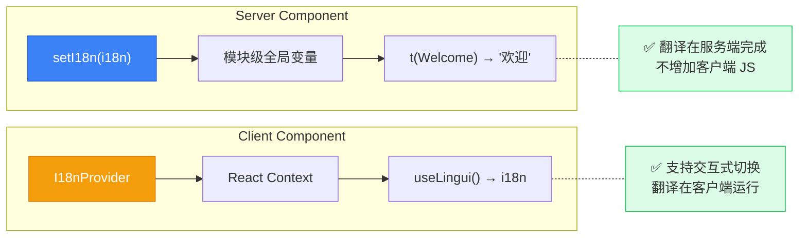

---

## 第五层：组件中使用翻译

### Server Components（服务端组件）

服务端组件可以直接使用 Lingui 的 `t` 宏：

```tsx
// 任意 Server Component
import { t } from "@lingui/core/macro";

export default function WelcomeBanner() {
  return (
    <section>
      <h1>{t`Welcome to EdgeMind Studio`}</h1>
      <p>{t`Build intelligent agents at the edge`}</p>
    </section>
  );
}
```

### Client Components（客户端组件）

客户端组件通过 `useLingui` Hook 获取 i18n 实例：

```tsx
"use client";

import { useLingui } from "@lingui/react/macro";

export function Greeting({ name }: { name: string }) {
  const { t } = useLingui();

  return (
    <div>
      <h2>{t`Hello, ${name}!`}</h2>
      <button>{t`Get Started`}</button>
    </div>
  );
}
```

### Trans 组件：处理富文本

当翻译中包含 JSX 元素时，使用 `Trans` 组件：

```tsx
import { Trans } from "@lingui/react/macro";

export function Agreement() {
  return (
    <p>
      <Trans>
        By signing up, you agree to our <a href="/terms">Terms of Service</a>
        and <a href="/privacy">Privacy Policy</a>.
      </Trans>
    </p>
  );
}
```

### 复数处理

```tsx
import { Plural } from "@lingui/react/macro";

export function ItemCount({ count }: { count: number }) {
  return (
    <span>
      <Plural value={count} one="# item" other="# items" />
    </span>
  );
}
// count=1 → "1 item"
// count=5 → "5 items"
// 中文: count=5 → "5 个项目"
```

### 使用方式速查表

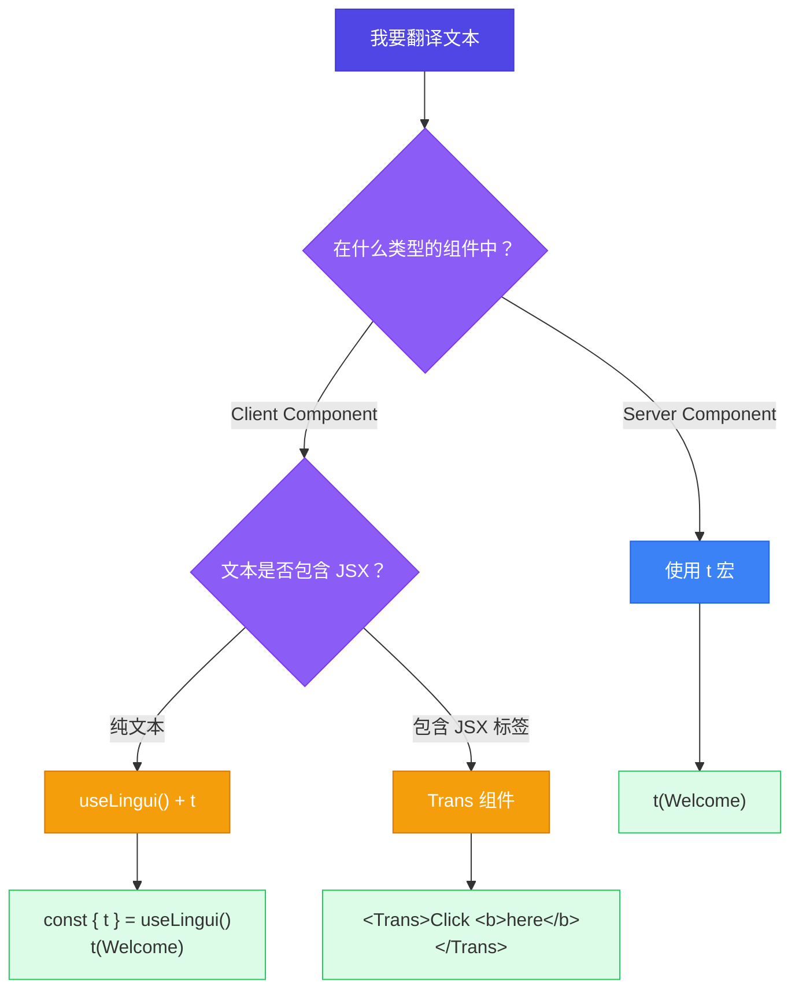

---

## 翻译工作流：从代码到 .po 文件

### 开发者工作流

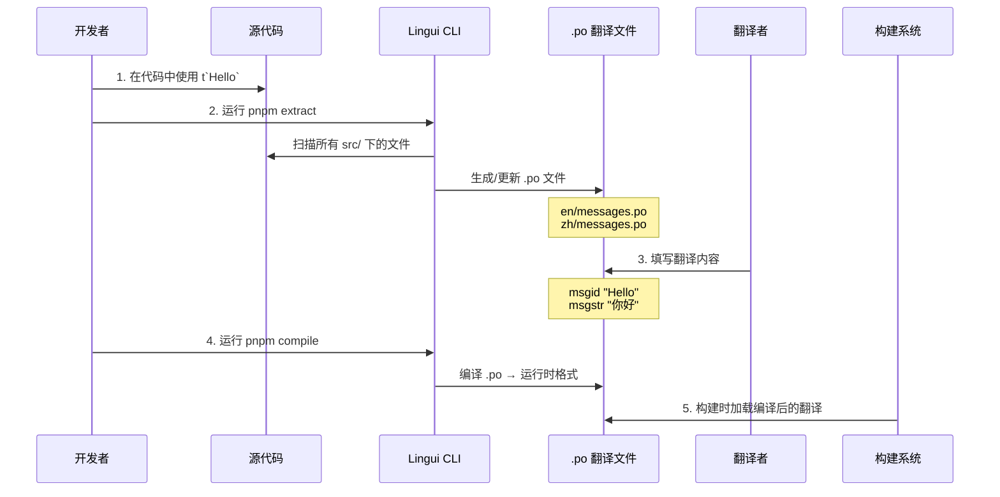

### 命令说明

| 命令 | 作用 | 何时运行 |
|------|------|---------|
| `pnpm extract` | 扫描代码，提取所有 `t`、`Trans` 等标记的文本，更新 `.po` 文件 | 添加新的可翻译文本后 |
| `pnpm compile` | 将 `.po` 文件编译为高效的运行时格式 | 翻译完成后、构建前 |
| `pnpm build` | 构建生产版本（自动加载编译后的翻译） | 部署前 |

### 添加新翻译的步骤

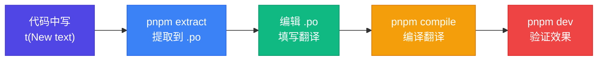

---

## 构建配置：SWC 插件与 Turbopack

### 为什么需要 SWC 插件？

Lingui 的 `t`、`Trans` 等是**宏 (macro)**，不是普通函数。它们需要在编译时被转换：

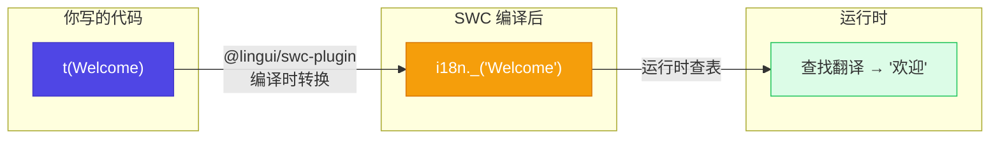

### next.config.ts 配置

```typescript
// next.config.ts
import type { NextConfig } from "next";

const nextConfig: NextConfig = {
  experimental: {
    // SWC 插件：编译时将 Lingui 宏转换为运行时调用
    swcPlugins: [["@lingui/swc-plugin", {}]],
  },
  turbopack: {
    rules: {
      // Turbopack 规则：让 .po 文件可以作为 JS 模块导入
      "*.po": {
        loaders: ["@lingui/loader"],
        as: "*.js",
      },
    },
  },
};
```

配置的两个部分各司其职：

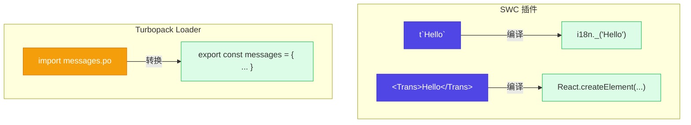

---

## 项目文件结构总览

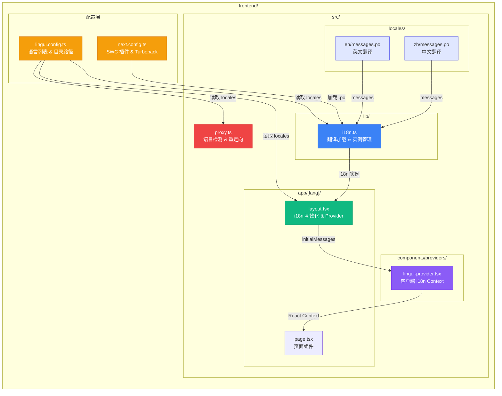

---

## 完整请求生命周期

把所有层串在一起，看一个完整的用户请求是如何处理的：

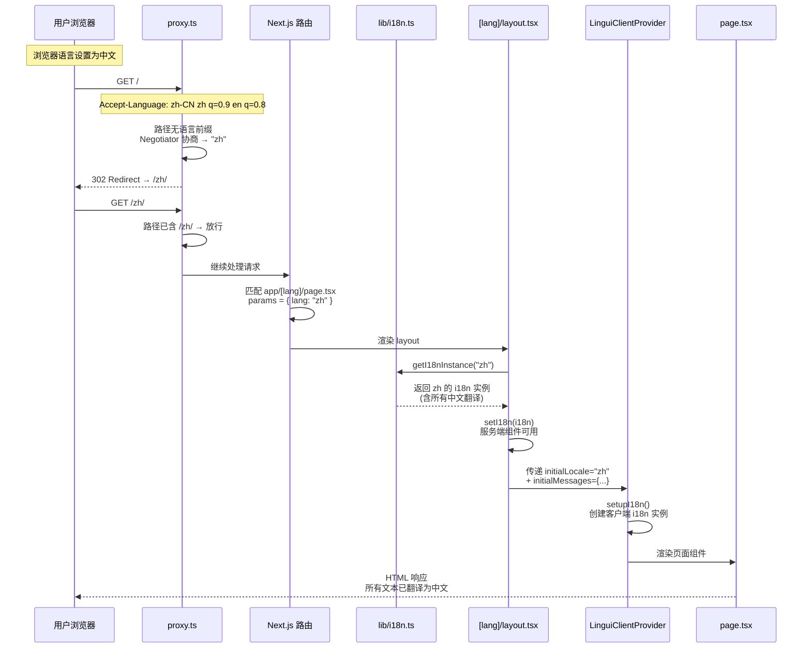

---

## 常见问题 FAQ

### Q1: 添加新语言需要改哪些地方？

只需 **一处**：修改 `lingui.config.ts` 的 `locales` 数组。

```typescript
// lingui.config.ts
export default defineConfig({
  locales: ["en", "zh", "ja"],  // 添加日语
  // ...
});
```

然后运行 `pnpm extract`，Lingui 会自动生成 `src/locales/ja/messages.po` 文件。

其他文件（proxy、layout、i18n.ts）都从 `linguiConfig.locales` 读取，无需修改。

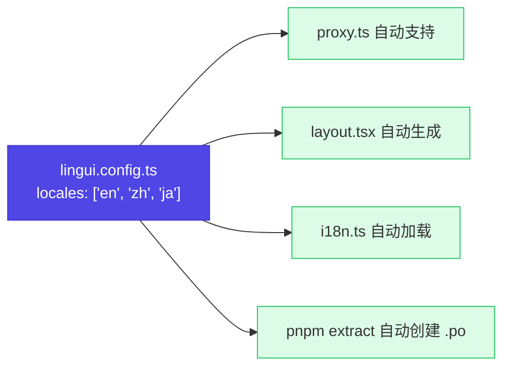

### Q2: Server Component 和 Client Component 的翻译有什么区别？

| | Server Component | Client Component |
|---|---|---|
| **i18n 来源** | `setI18n()` 模块全局变量 | `I18nProvider` React Context |
| **翻译执行位置** | 服务端 | 客户端（浏览器） |
| **API** | `t` 宏, `msg` | `useLingui()` Hook, `Trans` |
| **客户端 JS 体积影响** | 无（翻译在服务端完成） | 翻译数据包含在客户端 bundle |
| **适用场景** | 静态文本、SEO 内容 | 交互式 UI、动态内容 |

### Q3: proxy.ts (原 middleware.ts) 的作用是什么？

Proxy 运行在 **所有路由匹配之前**，是请求处理的第一道关卡。在 i18n 场景中，它的职责是：

1. 检测用户没有指定语言前缀的请求
2. 根据浏览器偏好自动重定向到对应语言路径
3. 已有语言前缀的请求直接放行

### Q4: `.po` 文件和 JSON 翻译文件有什么区别？

`.po` (Portable Object) 是 GNU Gettext 标准，被翻译行业广泛使用：

- **专业翻译工具原生支持** —— Crowdin、Transifex、POEdit 等可直接编辑
- **包含元数据** —— 翻译者注释、上下文信息、来源文件位置
- **自动合并** —— 新增/删除的翻译键会自动同步，不会丢失已有翻译
- **ICU 语法** —— 原生支持复数、性别、选择等高级语法

### Q5: 生产环境构建流程是怎样的？

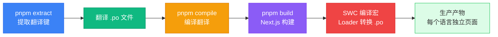

---

## 总结

本项目的 Next.js 国际化方案可以用一句话概括：

> **URL 路由分语言，Proxy 自动检测，Lingui 编译时翻译，服务端/客户端双轨注入。**

各层分工明确：

| 层 | 文件 | 职责 |
|----|------|------|
| 配置 | `lingui.config.ts` | 定义支持的语言和翻译文件路径 |
| 构建 | `next.config.ts` | SWC 宏编译 + .po 文件加载 |
| 拦截 | `proxy.ts` | 检测用户语言，自动重定向 |
| 路由 | `app/[lang]/` | URL 中携带语言参数 |
| 加载 | `lib/i18n.ts` | 预加载翻译，缓存 i18n 实例 |
| 注入 | `layout.tsx` + `lingui-provider.tsx` | 服务端/客户端双路径注入 |
| 使用 | 各组件 | `t` 宏 / `useLingui` / `Trans` |

这套架构的优势在于：**新增语言只需改一行配置**，翻译流程标准化（`.po` 文件），构建时编译宏保证零运行时开销，服务端翻译不增加客户端体积。
