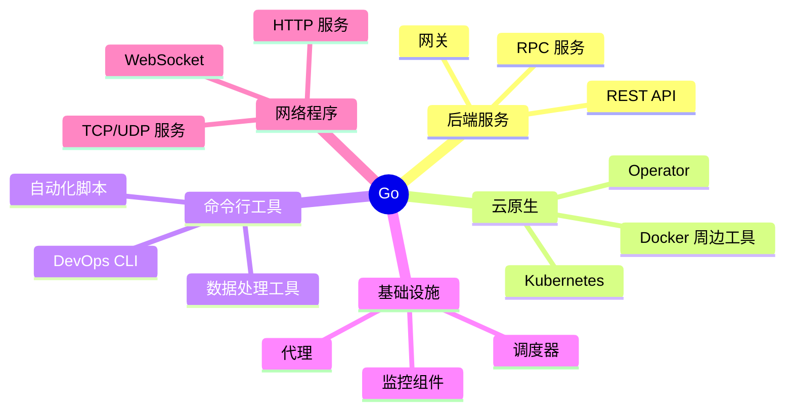
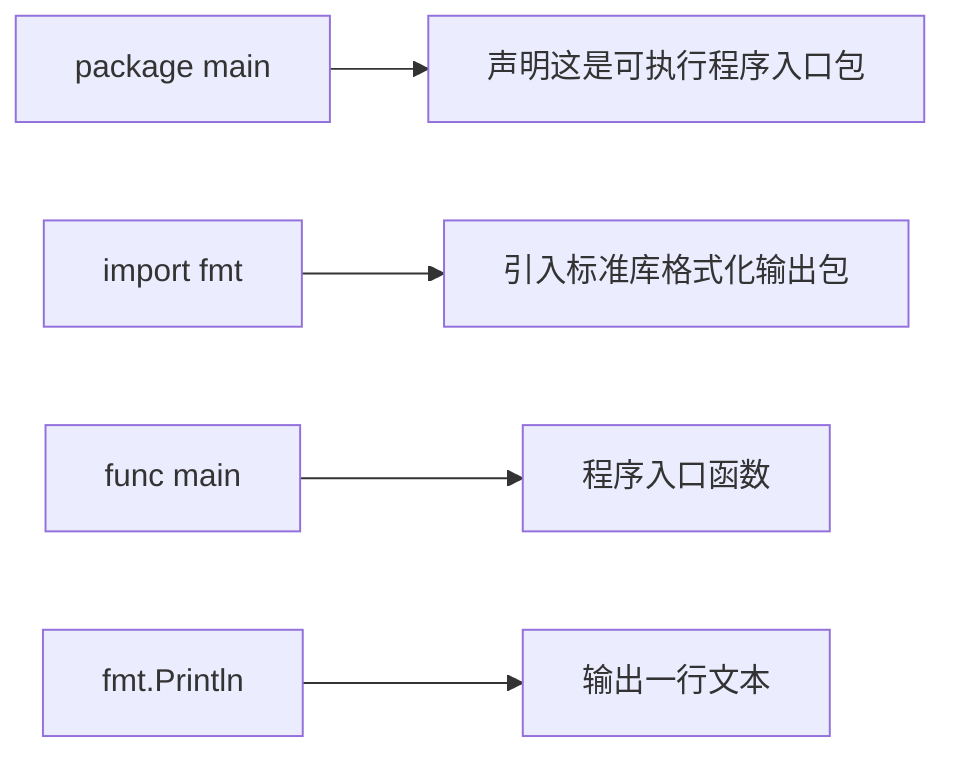

# Go 是什么，适合做什么

Go，也常叫 Golang，是 Google 开源的一门静态类型、编译型语言。它的核心目标不是“语法炫”，而是让工程团队能写出容易编译、部署、维护的服务端程序。

如果用你熟悉的 Rust 和 TypeScript 做类比：

| 角度 | Go | Rust | TypeScript |
| --- | --- | --- | --- |
| 类型 | 静态类型 | 静态类型，类型系统更强 | 静态类型叠在 JS 上 |
| 内存 | GC 自动回收 | 所有权 + 借用检查 | 运行时由 JS 引擎管理 |
| 并发 | goroutine + channel | async/await、线程、channel | event loop + Promise |
| 编译产物 | 常见是单个二进制 | 单个二进制 | 常见是 JS bundle |
| 主要场景 | 后端服务、CLI、云原生、基础设施 | 系统、性能关键、嵌入式、后端 | 前端、Node、全栈 |

## Go 的气质

Go 的设计偏工程化：

- 语法少，读代码比写花活更重要。
- 标准库强，HTTP、JSON、测试、模板、压缩、加密都内置。
- 编译快，部署简单，常见后端服务可以编译成一个二进制。
- 并发模型轻量，适合网络服务和大量 I/O。
- 格式化统一，`gofmt` 让代码风格争论少很多。

## Go 主要用来干什么



## 第一个可运行例子

创建一个目录：

```powershell
mkdir hello-go
cd hello-go
go mod init example.com/hello-go
```

写入 `main.go`：

```go
package main

import "fmt"

func main() {
	fmt.Println("Hello, Go!")
}
```

运行：

```powershell
go run .
```

你会看到：

```text
Hello, Go!
```

## 这几行代码分别是什么意思



几个关键点：

- `package main` 表示这个包会编译成可执行程序。
- `func main()` 是入口函数，类似 Rust 的 `fn main()`。
- `fmt.Println` 来自标准库 `fmt` 包。
- Go 语句末尾通常不写分号。

## 和 Rust/TS 的心智差异

Rust 写起来会经常考虑所有权、生命周期、trait bound。Go 通常先把数据结构和流程写清楚，内存回收交给 GC。

TypeScript 常见运行方式是 Node.js 或浏览器。Go 常见运行方式是直接编译成一个可执行文件：

```powershell
go build
.\hello-go.exe
```

Go 也有 `go run`，适合学习和本地开发；`go build` 更像正式构建。
