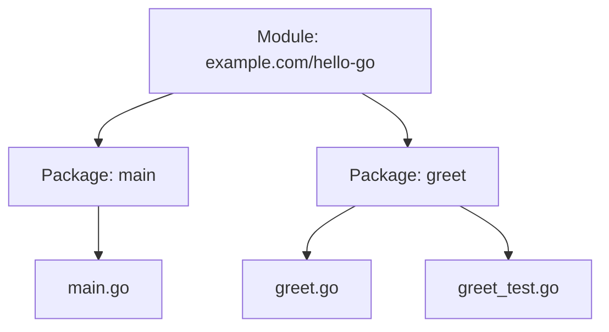
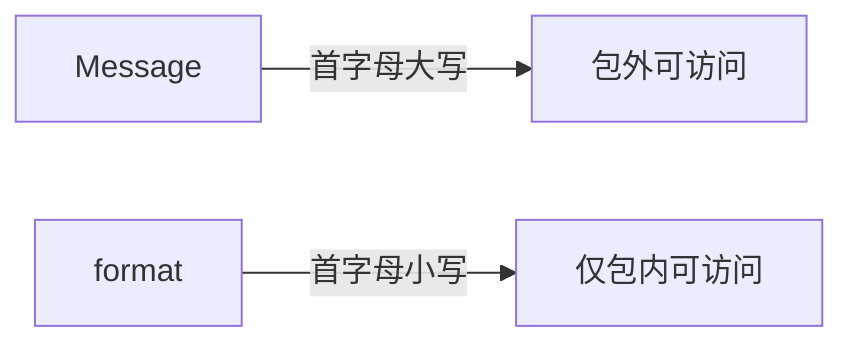
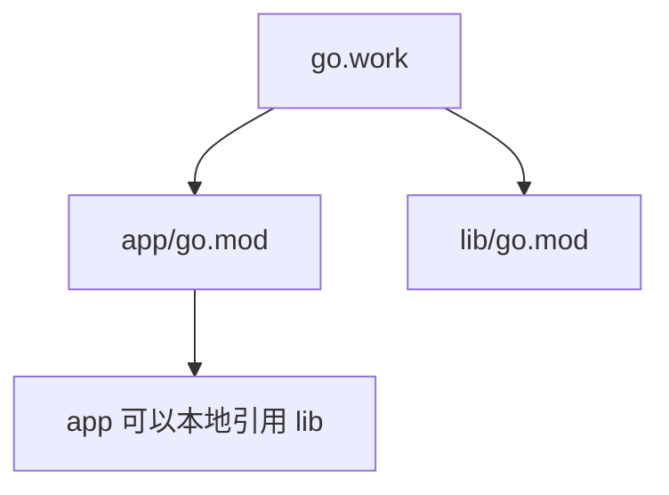

# 从 hello world 到项目结构

Go 现代项目的核心是 **module**。你可以把 module 粗略理解成 Rust 的 crate package，或者 TypeScript 的一个 npm package。

一个最小 Go 项目通常长这样：

```text
hello-go/
  go.mod
  main.go
```

## 初始化项目

Go 里没有完全等同于 `cargo new` 的默认命令，最常用的是：

```powershell
mkdir hello-go
cd hello-go
go mod init example.com/hello-go
```

生成的 `go.mod` 大概像这样：

```go
module example.com/hello-go

go 1.26.3
```

`module example.com/hello-go` 是模块路径。以后你在模块内部写包时，会用这个路径作为 import 前缀。

## module、package、file 的关系



粗略规则：

- 一个 module 由一个 `go.mod` 管理。
- 一个目录通常就是一个 package。
- 同一目录下的 `.go` 文件必须声明同一个 package，测试文件可以用同包或外部测试包。
- `package main` + `func main()` 会生成可执行程序。

## 可运行例子：拆出一个包

目录结构：

```text
hello-go/
  go.mod
  main.go
  greet/
    greet.go
```

`greet/greet.go`：

```go
package greet

import "fmt"

func Message(name string) string {
	return fmt.Sprintf("Hello, %s!", name)
}
```

`main.go`：

```go
package main

import (
	"fmt"

	"example.com/hello-go/greet"
)

func main() {
	fmt.Println(greet.Message("Go"))
}
```

运行：

```powershell
go run .
```

输出：

```text
Hello, Go!
```

## 大小写决定可见性

Go 没有 `pub`、`private`、`export` 关键字。它用首字母大小写控制可见性：

```go
func Message(name string) string { // 导出：其他 package 可以调用
	return format(name)
}

func format(name string) string { // 未导出：只有当前 package 可用
	return "Hello, " + name + "!"
}
```



这点对 Rust 用户尤其重要：Go 的导出规则非常简单，但也意味着命名本身就是 API 边界。

## 常用命令

| 命令 | 用途 |
| --- | --- |
| `go run .` | 编译并运行当前 package |
| `go build` | 编译当前 package |
| `go test ./...` | 测试当前 module 下所有 package |
| `go fmt ./...` | 格式化代码 |
| `go mod tidy` | 整理依赖 |
| `go doc fmt.Println` | 查看文档 |

## 工作区 go.work

当你同时开发多个 module 时，可以用 workspace：

```powershell
go work init ./app ./lib
```



初学阶段先不用急着学 `go.work`。一个 `go.mod` 足够支撑大多数练习项目。
