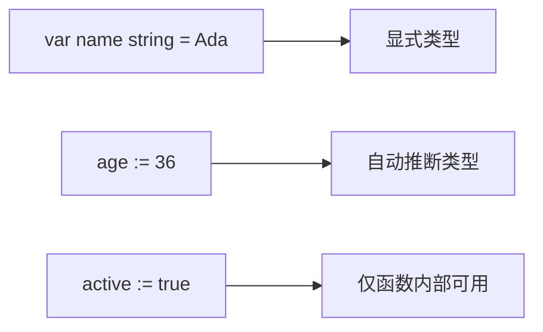
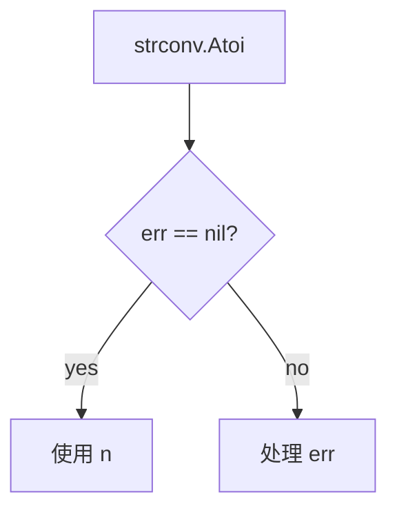
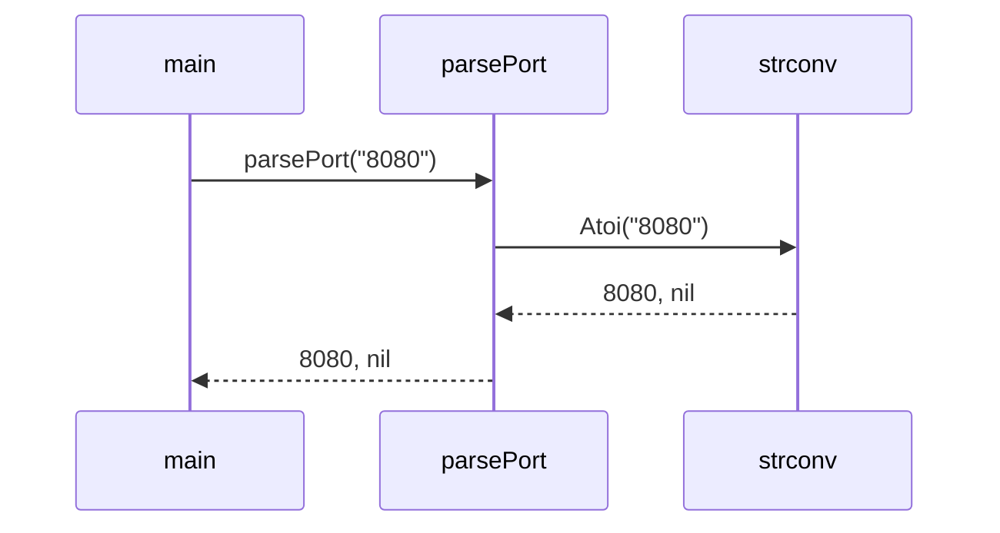
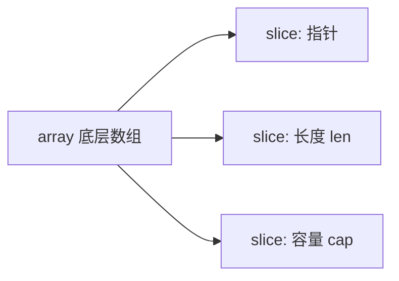

# 基础语法：变量、流程控制、函数

Go 的基础语法很小。你已经有 Rust 和 TS 经验，可以重点关注它的几个习惯：类型放在变量名后面、`:=` 短声明、`if`/`for` 的写法、函数可以返回多个值。

## 变量声明

可运行例子：

```go
package main

import "fmt"

func main() {
	var name string = "Ada"
	age := 36
	active := true

	fmt.Println(name, age, active)
}
```

运行：

```powershell
go run main.go
```



注意：

- `:=` 只能在函数内部使用。
- 包级变量要用 `var`。
- Go 的零值很重要：`int` 是 `0`，`string` 是 `""`，`bool` 是 `false`，指针/slice/map/channel/function/interface 是 `nil`。

## 常量

```go
package main

import "fmt"

const appName = "todo-cli"
const maxRetry = 3

func main() {
	fmt.Println(appName, maxRetry)
}
```

Go 的 `const` 是编译期常量，常用于数字、字符串、布尔值。

## if 可以带初始化语句

```go
package main

import (
	"fmt"
	"strconv"
)

func main() {
	if n, err := strconv.Atoi("42"); err == nil {
		fmt.Println(n + 1)
	} else {
		fmt.Println("parse failed:", err)
	}
}
```

这里的 `n` 和 `err` 只在 `if`/`else` 内可见。



## Go 只有 for，没有 while

普通循环：

```go
package main

import "fmt"

func main() {
	for i := 0; i < 3; i++ {
		fmt.Println(i)
	}
}
```

类似 while：

```go
package main

import "fmt"

func main() {
	n := 3
	for n > 0 {
		fmt.Println(n)
		n--
	}
}
```

无限循环：

```go
for {
	// do something
}
```

## switch 默认不会 fallthrough

```go
package main

import "fmt"

func main() {
	status := 200

	switch status {
	case 200:
		fmt.Println("ok")
	case 404:
		fmt.Println("not found")
	default:
		fmt.Println("unknown")
	}
}
```

和 C/JS 不同，Go 的 `switch` 默认不会继续执行下一个 `case`。

## 函数和多返回值

Go 很喜欢用多返回值表达“结果 + 错误”：

```go
package main

import (
	"fmt"
	"strconv"
)

func parsePort(input string) (int, error) {
	return strconv.Atoi(input)
}

func main() {
	port, err := parsePort("8080")
	if err != nil {
		fmt.Println("bad port:", err)
		return
	}

	fmt.Println("server port:", port)
}
```



你可以把 `(T, error)` 看成 Go 的常见 Result 风格，不过它不是枚举，而是两个返回值。

## slice：最常用的集合

```go
package main

import "fmt"

func main() {
	names := []string{"Ada", "Linus"}
	names = append(names, "Grace")

	for i, name := range names {
		fmt.Println(i, name)
	}
}
```



slice 类似动态数组视图。平时写业务代码，`[]T` 比 `[N]T` 常见得多。

## map

```go
package main

import "fmt"

func main() {
	scores := map[string]int{
		"Ada":   100,
		"Linus": 95,
	}

	score, ok := scores["Grace"]
	if !ok {
		fmt.Println("Grace has no score")
		return
	}

	fmt.Println(score)
}
```

`value, ok := m[key]` 是 Go 里很常见的存在性检查。
