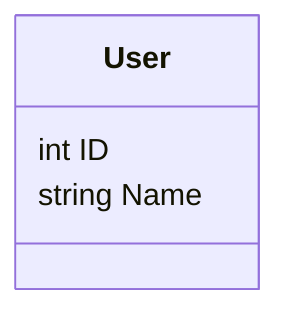
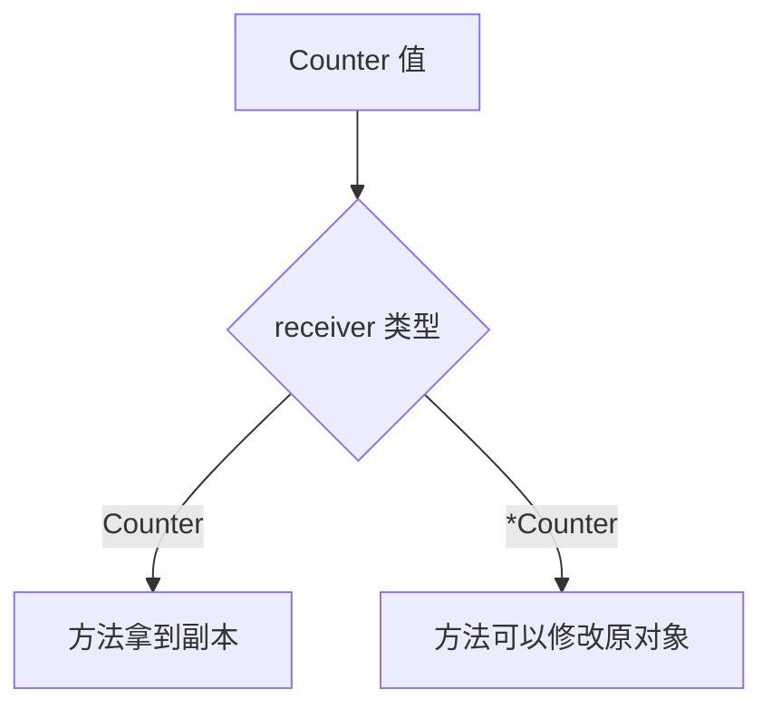
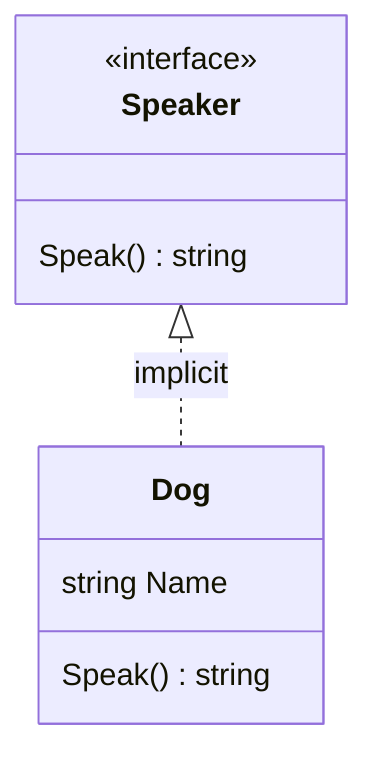
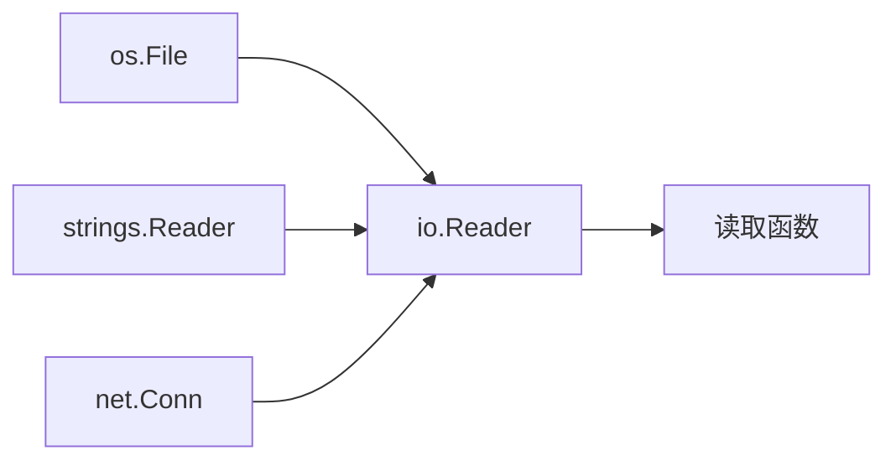

# 类型系统：struct、method、interface、泛型

Go 的类型系统比 TS 更“硬”，但比 Rust 简单很多。最常用的组合是 `struct + method + interface`。

## struct

可运行例子：

```go
package main

import "fmt"

type User struct {
	ID   int
	Name string
}

func main() {
	u := User{ID: 1, Name: "Ada"}
	fmt.Println(u.ID, u.Name)
}
```



Go 没有 class。`struct` 只负责数据，方法单独声明。

## method

```go
package main

import "fmt"

type User struct {
	Name string
}

func (u User) Greet() string {
	return "Hello, " + u.Name
}

func main() {
	u := User{Name: "Ada"}
	fmt.Println(u.Greet())
}
```

`func (u User) Greet()` 里的 `(u User)` 叫 receiver。它类似“给 User 这个类型挂一个方法”。

## 值 receiver 和指针 receiver

如果方法要修改原对象，用指针 receiver：

```go
package main

import "fmt"

type Counter struct {
	Value int
}

func (c *Counter) Inc() {
	c.Value++
}

func main() {
	c := Counter{}
	c.Inc()
	c.Inc()
	fmt.Println(c.Value)
}
```

输出：

```text
2
```



Go 有指针，但没有 Rust 那样的借用检查器。你仍然应该避免随手共享可变状态。

## interface：隐式实现

Go 的 interface 最像 Rust trait，但实现方式更像“结构相同就算实现”。你不需要写 `impl`。

```go
package main

import "fmt"

type Speaker interface {
	Speak() string
}

type Dog struct {
	Name string
}

func (d Dog) Speak() string {
	return d.Name + " says woof"
}

func announce(s Speaker) {
	fmt.Println(s.Speak())
}

func main() {
	announce(Dog{Name: "Momo"})
}
```



只要 `Dog` 有 `Speak() string` 方法，它就满足 `Speaker`。

## interface 的常见用法

Go interface 通常应该小。标准库里经典例子是：

```go
type Reader interface {
	Read(p []byte) (n int, err error)
}
```

一个方法就能抽象大量输入来源：文件、网络连接、字符串、压缩流。



## 泛型

Go 有泛型，但日常代码里不需要像 Rust 那样频繁写类型参数。适合用在容器、算法、工具函数。

```go
package main

import "fmt"

func First[T any](items []T) (T, bool) {
	var zero T
	if len(items) == 0 {
		return zero, false
	}
	return items[0], true
}

func main() {
	name, ok := First([]string{"Ada", "Grace"})
	fmt.Println(name, ok)

	n, ok := First([]int{10, 20})
	fmt.Println(n, ok)
}
```

```mermaid
flowchart TD
    A[First T any] --> B[[]string]
    A --> C[[]int]
    A --> D[[]自定义类型]
```

经验规则：

- 业务类型优先用具体类型和小 interface。
- 重复的容器或算法逻辑再考虑泛型。
- 不要为了“像 Rust/TS 一样抽象”而提前抽象。
