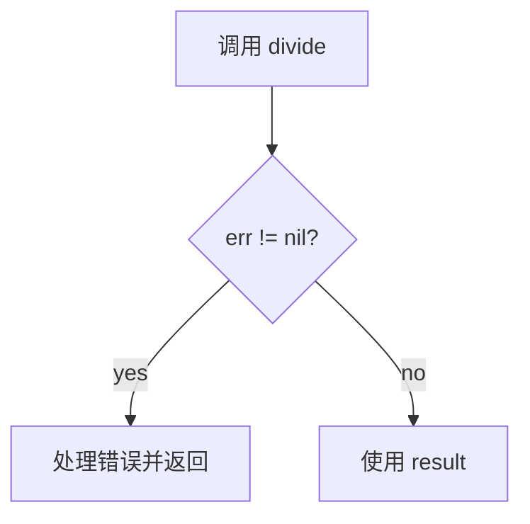
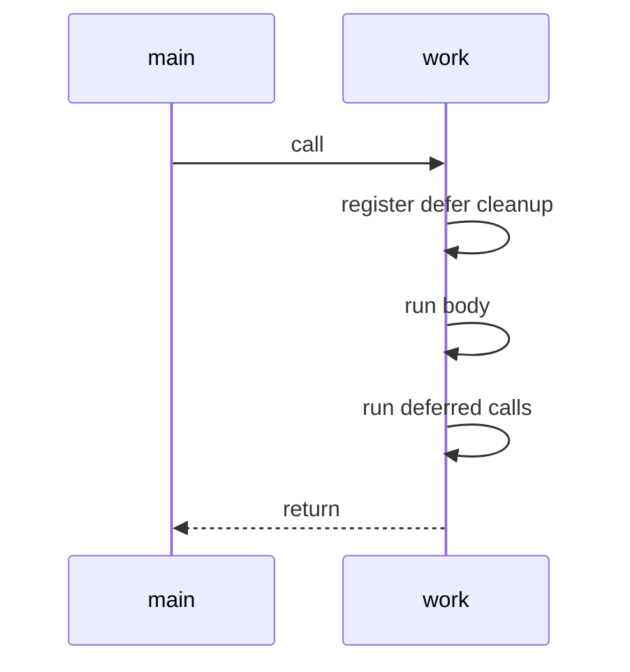
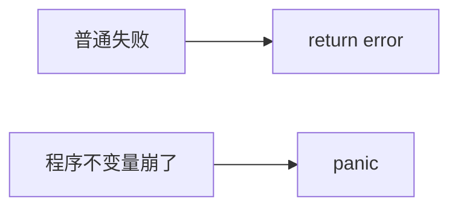
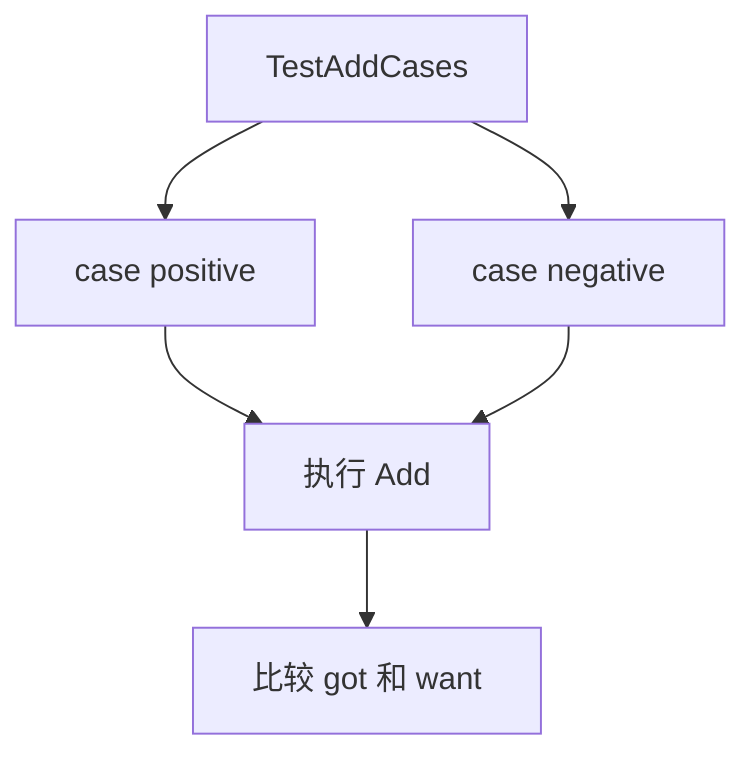

# 错误处理、defer 和测试

Go 没有异常作为常规控制流，也没有 Rust 那样的 `?`。它最常见的错误处理方式是显式返回 `error`。

## error 基础

可运行例子：

```go
package main

import (
	"errors"
	"fmt"
)

func divide(a, b int) (int, error) {
	if b == 0 {
		return 0, errors.New("divide by zero")
	}
	return a / b, nil
}

func main() {
	result, err := divide(10, 0)
	if err != nil {
		fmt.Println("failed:", err)
		return
	}

	fmt.Println(result)
}
```



Go 的错误处理看起来啰嗦，但优点是控制流非常明确。

## 包装错误

用 `%w` 保留原始错误，方便上层判断：

```go
package main

import (
	"errors"
	"fmt"
	"strconv"
)

func parseAge(input string) (int, error) {
	n, err := strconv.Atoi(input)
	if err != nil {
		return 0, fmt.Errorf("parse age %q: %w", input, err)
	}
	return n, nil
}

func main() {
	_, err := parseAge("abc")
	if err != nil {
		fmt.Println(err)
		fmt.Println("is syntax error:", errors.Is(err, strconv.ErrSyntax))
	}
}
```

## defer：函数结束前执行

`defer` 常用于释放资源，例如关闭文件、解锁、记录耗时。

```go
package main

import "fmt"

func work() {
	defer fmt.Println("cleanup")

	fmt.Println("start")
	fmt.Println("working")
}

func main() {
	work()
}
```

输出：

```text
start
working
cleanup
```



如果有多个 `defer`，它们后进先出：

```go
defer fmt.Println("first")
defer fmt.Println("second")
```

会先输出 `second`，再输出 `first`。

## panic 不是日常错误处理

`panic` 更适合不可恢复的程序错误，比如内部不变量被破坏。业务错误、用户输入错误、网络错误，通常返回 `error`。



## 测试

Go 内置测试框架。文件名以 `_test.go` 结尾，测试函数以 `Test` 开头。

目录：

```text
calc/
  go.mod
  add.go
  add_test.go
```

`add.go`：

```go
package calc

func Add(a, b int) int {
	return a + b
}
```

`add_test.go`：

```go
package calc

import "testing"

func TestAdd(t *testing.T) {
	got := Add(2, 3)
	want := 5

	if got != want {
		t.Fatalf("Add(2, 3) = %d, want %d", got, want)
	}
}
```

运行：

```powershell
go test ./...
```

## 表格驱动测试

Go 社区很喜欢 table-driven tests：

```go
package calc

import "testing"

func TestAddCases(t *testing.T) {
	cases := []struct {
		name string
		a    int
		b    int
		want int
	}{
		{name: "positive", a: 2, b: 3, want: 5},
		{name: "negative", a: -2, b: 3, want: 1},
	}

	for _, tc := range cases {
		t.Run(tc.name, func(t *testing.T) {
			got := Add(tc.a, tc.b)
			if got != tc.want {
				t.Fatalf("got %d, want %d", got, tc.want)
			}
		})
	}
}
```


