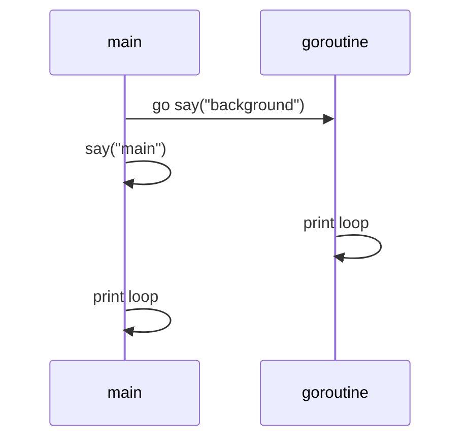
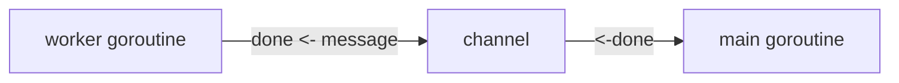
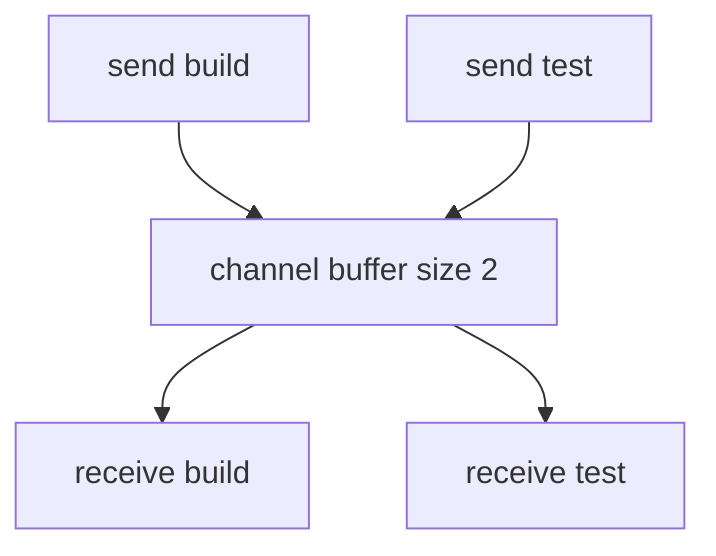
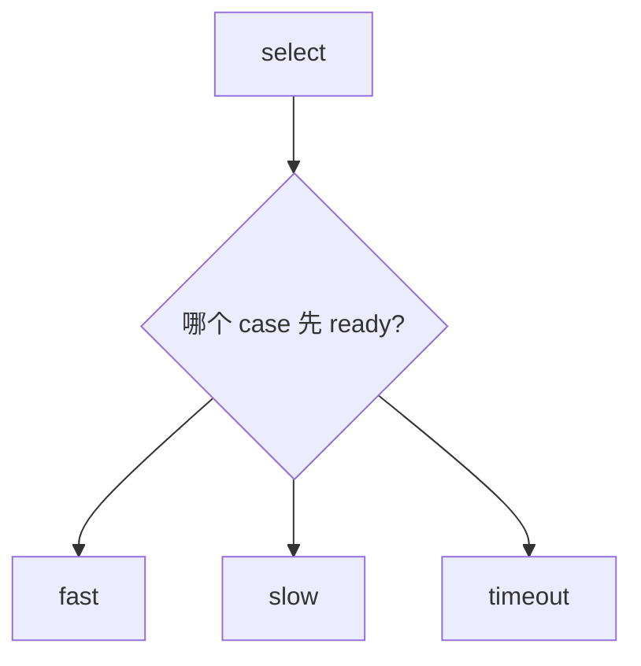
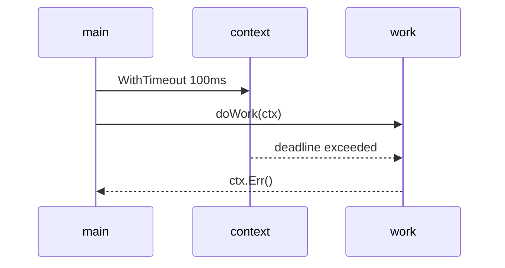

# 并发：goroutine、channel、context

Go 的并发是它最有辨识度的部分。核心概念有三个：goroutine、channel、context。

## goroutine

goroutine 是 Go 的轻量级并发执行单元。启动方式很简单：在函数调用前加 `go`。

可运行例子：

```go
package main

import (
	"fmt"
	"time"
)

func say(message string) {
	for i := 0; i < 3; i++ {
		fmt.Println(message, i)
		time.Sleep(100 * time.Millisecond)
	}
}

func main() {
	go say("background")
	say("main")
}
```

运行时你会看到两组输出交错出现。



注意：如果 `main` 结束，整个程序就结束，后台 goroutine 不会继续运行。

## channel

channel 用来在 goroutine 之间传值。

```go
package main

import "fmt"

func worker(done chan string) {
	done <- "job finished"
}

func main() {
	done := make(chan string)

	go worker(done)

	message := <-done
	fmt.Println(message)
}
```



发送和接收默认会阻塞：

- 发送方会等到有人接收。
- 接收方会等到有人发送。

这让 channel 自带同步能力。

## 带缓冲 channel

```go
package main

import "fmt"

func main() {
	jobs := make(chan string, 2)

	jobs <- "build"
	jobs <- "test"

	fmt.Println(<-jobs)
	fmt.Println(<-jobs)
}
```

缓冲区没满时，发送不会立刻阻塞。



## range channel 和 close

```go
package main

import "fmt"

func main() {
	numbers := make(chan int)

	go func() {
		for i := 1; i <= 3; i++ {
			numbers <- i
		}
		close(numbers)
	}()

	for n := range numbers {
		fmt.Println(n)
	}
}
```

`close` 表示不会再发送新值。接收方可以用 `range` 读到 channel 关闭。

## select：等待多个 channel

```go
package main

import (
	"fmt"
	"time"
)

func main() {
	fast := make(chan string)
	slow := make(chan string)

	go func() {
		time.Sleep(100 * time.Millisecond)
		fast <- "fast result"
	}()

	go func() {
		time.Sleep(300 * time.Millisecond)
		slow <- "slow result"
	}()

	select {
	case msg := <-fast:
		fmt.Println(msg)
	case msg := <-slow:
		fmt.Println(msg)
	case <-time.After(200 * time.Millisecond):
		fmt.Println("timeout")
	}
}
```



## context：取消和超时

后端服务里，`context.Context` 很常见。它用来传递取消信号、超时和请求级信息。

```go
package main

import (
	"context"
	"fmt"
	"time"
)

func doWork(ctx context.Context) error {
	select {
	case <-time.After(500 * time.Millisecond):
		fmt.Println("work done")
		return nil
	case <-ctx.Done():
		return ctx.Err()
	}
}

func main() {
	ctx, cancel := context.WithTimeout(context.Background(), 100*time.Millisecond)
	defer cancel()

	if err := doWork(ctx); err != nil {
		fmt.Println("failed:", err)
	}
}
```

输出通常是：

```text
failed: context deadline exceeded
```



## 并发学习建议

- 先用 goroutine + channel 写小例子。
- 写真实服务时，多关注 `context` 和 goroutine 生命周期。
- 不要为了并发而并发。简单循环能解决的问题，不一定需要 goroutine。
- 共享内存时用 `sync.Mutex` 或其他同步原语，别假设“看起来不会冲突”。
