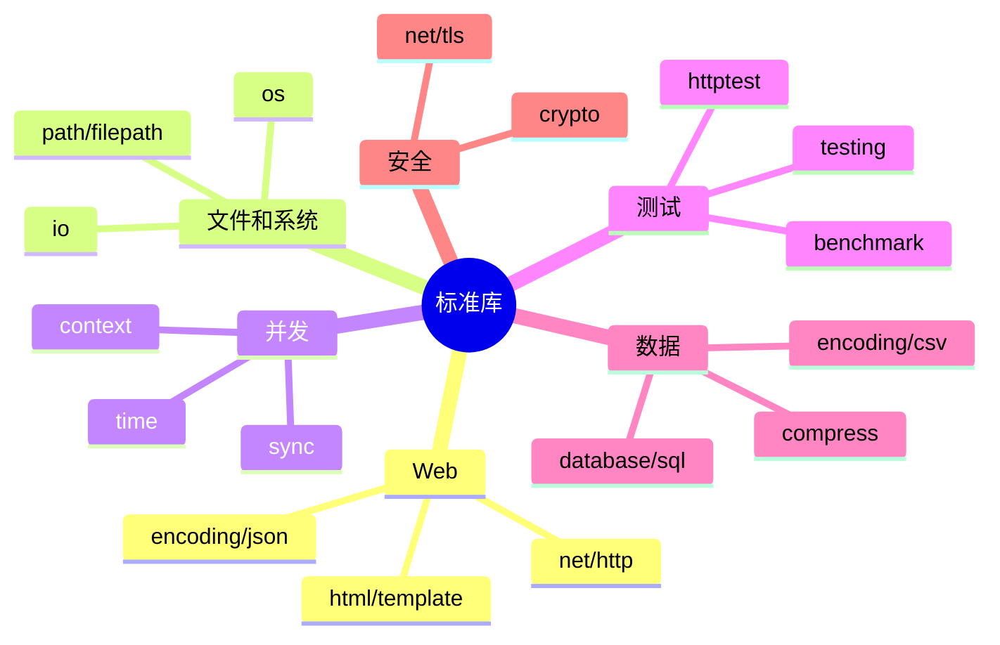
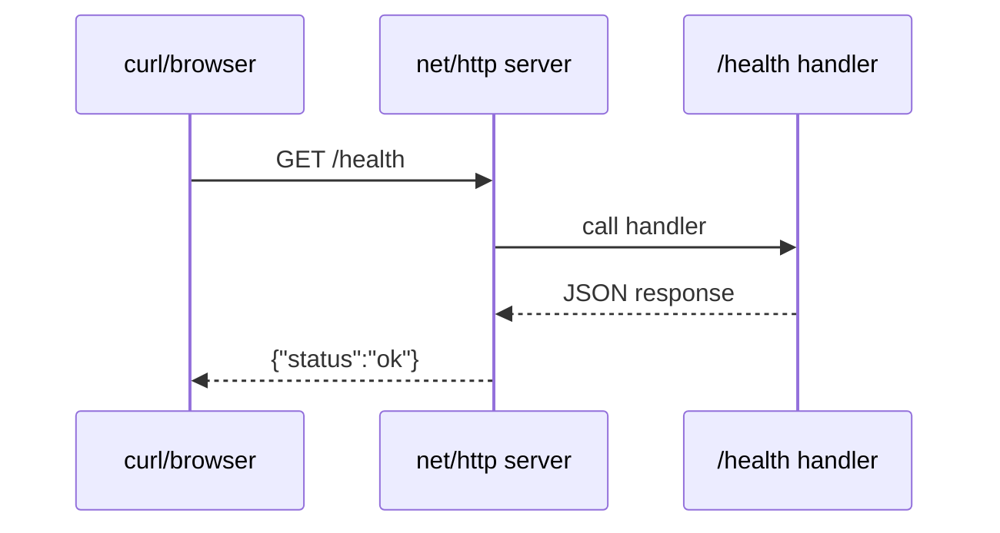
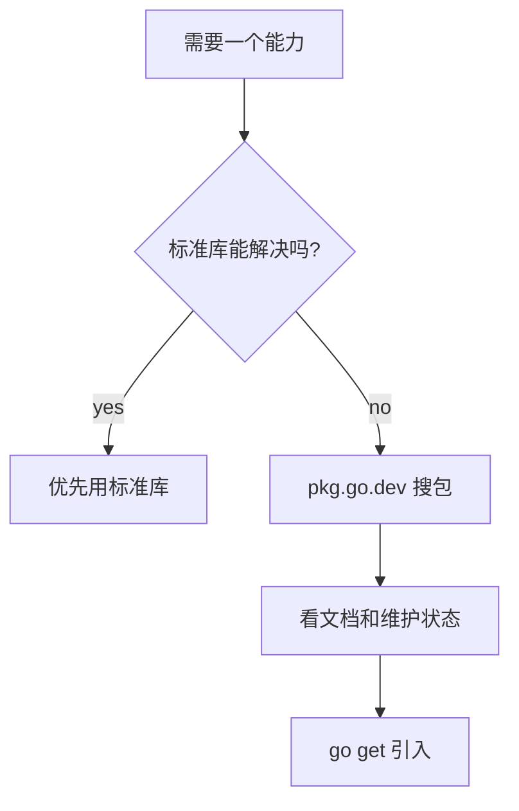
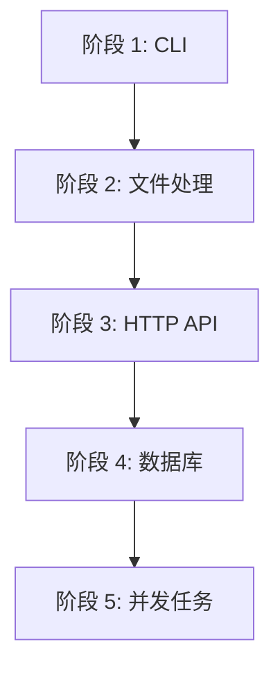
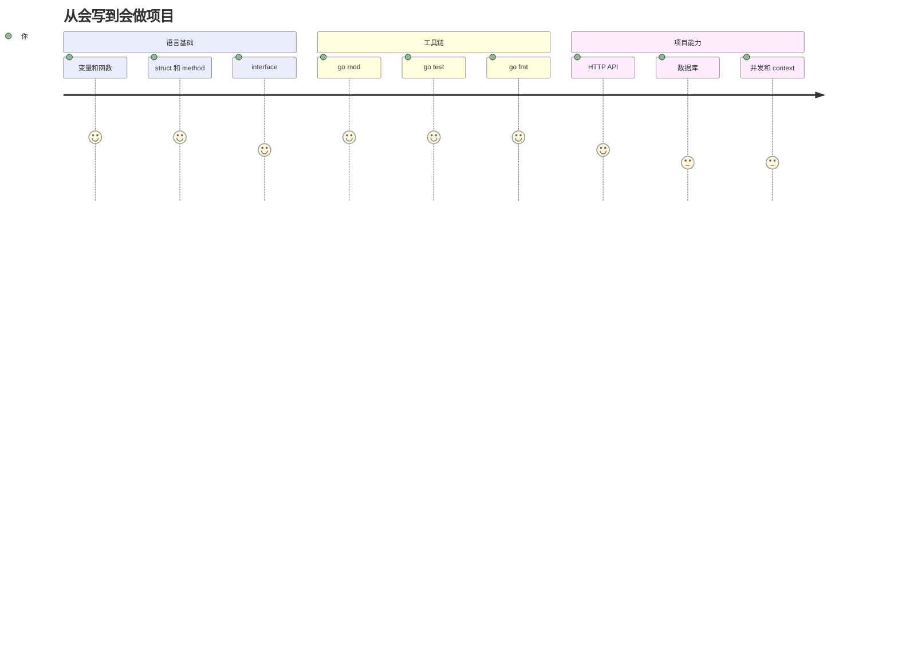

# 生态系统和下一步路线

Go 的生态非常偏工程实践。它不追求框架层层叠加，而是鼓励先用标准库解决大部分问题，再按需引入第三方库。

## 标准库优先

Go 标准库覆盖了很多常见后端需求：



官方标准库文档入口：https://pkg.go.dev/std

## 一个不用框架的 HTTP 服务

这个例子可以直接运行，展示 Go 为什么常用于后端服务。

`main.go`：

```go
package main

import (
	"encoding/json"
	"log"
	"net/http"
)

type Health struct {
	Status string `json:"status"`
}

func main() {
	http.HandleFunc("/health", func(w http.ResponseWriter, r *http.Request) {
		w.Header().Set("Content-Type", "application/json")
		json.NewEncoder(w).Encode(Health{Status: "ok"})
	})

	log.Println("listening on http://localhost:8080")
	log.Fatal(http.ListenAndServe(":8080", nil))
}
```

运行：

```powershell
go run .
```

访问：

```powershell
curl http://localhost:8080/health
```

输出：

```json
{"status":"ok"}
```



## 常见生态方向

| 方向 | 常见选择 | 什么时候学 |
| --- | --- | --- |
| Web 路由 | 标准库 `net/http`、chi、gin | 先标准库，再学一个路由库 |
| 数据库 | `database/sql`、sqlx、gorm、ent | 做 CRUD 项目时 |
| CLI | cobra、urfave/cli、标准库 `flag` | 写命令行工具时 |
| 配置 | viper、envconfig | 项目开始有多环境配置时 |
| 日志 | slog、zap、zerolog | 写服务时先学标准库 `log/slog` |
| RPC | gRPC、Connect | 服务间通信时 |
| 云原生 | Kubernetes client-go、controller-runtime | 做 K8s 或 operator 时 |
| 测试断言 | 标准库、testify | 标准库熟了再用 |

Go 现在内置 `log/slog`，写结构化日志可以先不用第三方库。

## pkg.go.dev 是 Go 的包搜索站

当你想查一个包：

1. 打开 https://pkg.go.dev/
2. 搜包名或 import path。
3. 看 README、文档、例子和版本。
4. 再决定是否引入。



## 引入第三方依赖

以 UUID 包为例：

```powershell
go get github.com/google/uuid
```

`main.go`：

```go
package main

import (
	"fmt"

	"github.com/google/uuid"
)

func main() {
	id := uuid.New()
	fmt.Println(id.String())
}
```

运行：

```powershell
go run .
```

整理依赖：

```powershell
go mod tidy
```

## 建议的练习项目



1. CLI 计算器：练变量、函数、错误处理。
2. Todo JSON 文件版：练 struct、slice、JSON、文件读写。
3. HTTP Todo API：练 `net/http`、路由、请求/响应。
4. SQLite/Postgres Todo：练数据库和 context。
5. 并发爬取标题：练 goroutine、channel、timeout。

## Go 工程习惯

- 运行 `go fmt ./...`，不要手动纠结格式。
- 运行 `go test ./...`，测试是标准工具链的一部分。
- 小 interface 放在使用方附近，而不是提前设计一堆大接口。
- 包名短小清晰，例如 `user`、`order`、`httpapi`。
- 错误要带上下文，例如 `fmt.Errorf("load config: %w", err)`。
- 项目初期目录保持简单，等复杂度真的出现再拆。

## 下一步学习路线



学到这里，你已经可以开始写一个真实的小服务了。Go 最好的学习方式就是少看语法百科，多写小而完整的程序。
