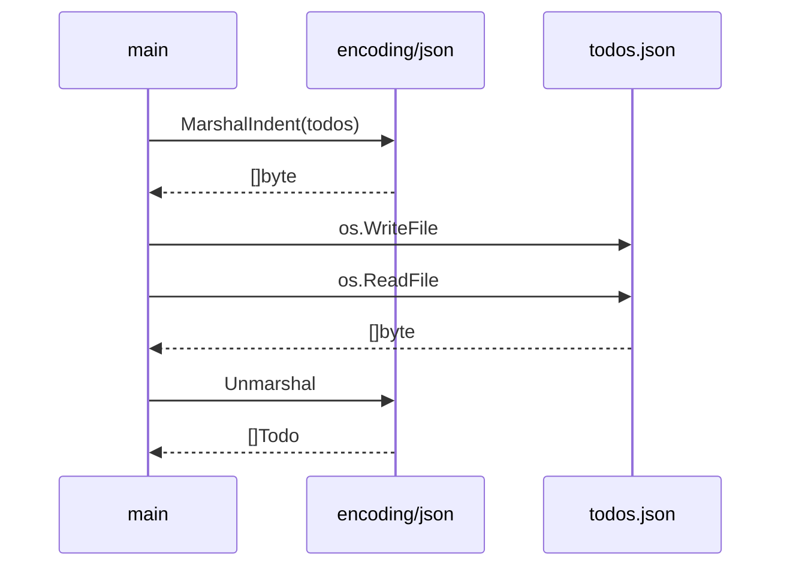

# JSON、文件读写和数据建模

Go 做后端、CLI、自动化工具时，经常要处理 JSON 和文件。标准库已经内置了 `encoding/json`、`os`、`io`，很多小工具不需要第三方库。

## JSON 和 struct tag

可运行例子：

```go
package main

import (
	"encoding/json"
	"fmt"
)

type User struct {
	ID    int    `json:"id"`
	Name  string `json:"name"`
	Email string `json:"email,omitempty"`
}

func main() {
	u := User{ID: 1, Name: "Ada"}

	data, err := json.MarshalIndent(u, "", "  ")
	if err != nil {
		fmt.Println("marshal:", err)
		return
	}

	fmt.Println(string(data))
}
```

输出：

```json
{
  "id": 1,
  "name": "Ada"
}
```

`omitempty` 表示字段是零值时不输出。这里 `Email` 是空字符串，所以被省略。


## 从 JSON 解析回 struct

```go
package main

import (
	"encoding/json"
	"fmt"
)

type User struct {
	ID   int    `json:"id"`
	Name string `json:"name"`
}

func main() {
	input := `{"id":1,"name":"Ada"}`

	var u User
	if err := json.Unmarshal([]byte(input), &u); err != nil {
		fmt.Println("unmarshal:", err)
		return
	}

	fmt.Printf("%+v\n", u)
}
```

注意这里传的是 `&u`，因为 `json.Unmarshal` 要修改变量内容。

## 写文件

```go
package main

import (
	"fmt"
	"os"
)

func main() {
	err := os.WriteFile("hello.txt", []byte("Hello, file!\n"), 0644)
	if err != nil {
		fmt.Println("write file:", err)
		return
	}

	fmt.Println("saved")
}
```

运行后当前目录会出现 `hello.txt`。

## 读文件

```go
package main

import (
	"fmt"
	"os"
)

func main() {
	data, err := os.ReadFile("hello.txt")
	if err != nil {
		fmt.Println("read file:", err)
		return
	}

	fmt.Print(string(data))
}
```

## 小项目：JSON Todo 文件

这是一个极小的可运行例子：启动程序，往 `todos.json` 写入两条 todo，然后再读回来。

```go
package main

import (
	"encoding/json"
	"fmt"
	"os"
)

type Todo struct {
	ID    int    `json:"id"`
	Title string `json:"title"`
	Done  bool   `json:"done"`
}

func saveTodos(path string, todos []Todo) error {
	data, err := json.MarshalIndent(todos, "", "  ")
	if err != nil {
		return fmt.Errorf("marshal todos: %w", err)
	}

	if err := os.WriteFile(path, data, 0644); err != nil {
		return fmt.Errorf("write todos: %w", err)
	}

	return nil
}

func loadTodos(path string) ([]Todo, error) {
	data, err := os.ReadFile(path)
	if err != nil {
		return nil, fmt.Errorf("read todos: %w", err)
	}

	var todos []Todo
	if err := json.Unmarshal(data, &todos); err != nil {
		return nil, fmt.Errorf("unmarshal todos: %w", err)
	}

	return todos, nil
}

func main() {
	path := "todos.json"
	todos := []Todo{
		{ID: 1, Title: "Learn Go JSON"},
		{ID: 2, Title: "Build a tiny CLI", Done: true},
	}

	if err := saveTodos(path, todos); err != nil {
		fmt.Println("save:", err)
		return
	}

	loaded, err := loadTodos(path)
	if err != nil {
		fmt.Println("load:", err)
		return
	}

	for _, todo := range loaded {
		fmt.Printf("%d. [%v] %s\n", todo.ID, todo.Done, todo.Title)
	}
}
```



## 和 Rust/TS 类比

Rust 里你可能会用 `serde`：

```rust
#[derive(Serialize, Deserialize)]
struct Todo {
    id: i32,
    title: String,
    done: bool,
}
```

TypeScript 里常见是：

```ts
type Todo = {
  id: number
  title: string
  done: boolean
}
```

Go 的特点是：JSON 支持在标准库里，字段映射靠 struct tag：

```go
Title string `json:"title"`
```

## 练习

把 Todo 文件例子改成：

- 如果 `todos.json` 不存在，就返回空列表。
- 新增一个 `addTodo(title string)` 函数。
- 新增一个 `markDone(id int)` 函数。
