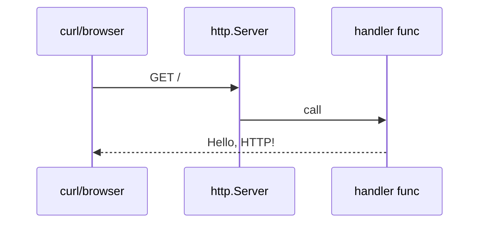
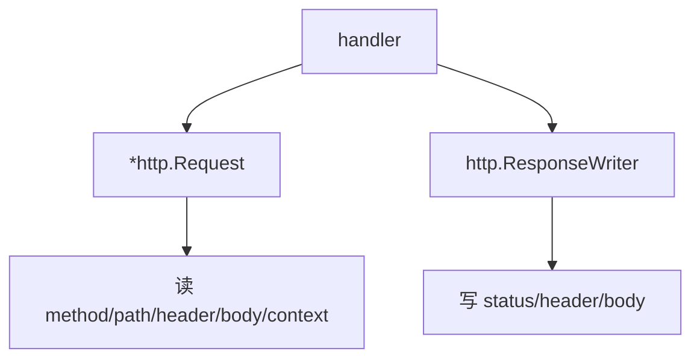

# 用标准库写 HTTP API

Go 的标准库 `net/http` 已经能写完整 HTTP 服务。很多时候你可以先不用 Gin、Echo、Fiber，先把标准库学明白。

## 最小 HTTP 服务

可运行例子：

```go
package main

import (
	"fmt"
	"log"
	"net/http"
)

func main() {
	http.HandleFunc("/", func(w http.ResponseWriter, r *http.Request) {
		fmt.Fprintln(w, "Hello, HTTP!")
	})

	log.Println("listening on http://localhost:8080")
	log.Fatal(http.ListenAndServe(":8080", nil))
}
```

运行：

```powershell
go run .
```

访问：

```powershell
curl http://localhost:8080
```



## 返回 JSON

```go
package main

import (
	"encoding/json"
	"log"
	"net/http"
)

type Message struct {
	Text string `json:"text"`
}

func main() {
	http.HandleFunc("/api/hello", func(w http.ResponseWriter, r *http.Request) {
		w.Header().Set("Content-Type", "application/json")
		json.NewEncoder(w).Encode(Message{Text: "Hello, JSON API!"})
	})

	log.Println("listening on http://localhost:8080")
	log.Fatal(http.ListenAndServe(":8080", nil))
}
```

## 读取请求 JSON

```go
package main

import (
	"encoding/json"
	"log"
	"net/http"
)

type CreateUserRequest struct {
	Name string `json:"name"`
}

type UserResponse struct {
	ID   int    `json:"id"`
	Name string `json:"name"`
}

func main() {
	http.HandleFunc("/api/users", func(w http.ResponseWriter, r *http.Request) {
		if r.Method != http.MethodPost {
			http.Error(w, "method not allowed", http.StatusMethodNotAllowed)
			return
		}

		var req CreateUserRequest
		if err := json.NewDecoder(r.Body).Decode(&req); err != nil {
			http.Error(w, "bad json", http.StatusBadRequest)
			return
		}

		w.Header().Set("Content-Type", "application/json")
		json.NewEncoder(w).Encode(UserResponse{ID: 1, Name: req.Name})
	})

	log.Println("listening on http://localhost:8080")
	log.Fatal(http.ListenAndServe(":8080", nil))
}
```

测试：

```powershell
curl -X POST http://localhost:8080/api/users -H "Content-Type: application/json" -d "{\"name\":\"Ada\"}"
```

## handler 的三个核心对象



`*http.Request` 是请求，`http.ResponseWriter` 是响应写入器。

## 小项目：内存 Todo API

这个例子只有内存数据，重启后数据会丢。优点是能直接运行，适合理解 HTTP API 流程。

```go
package main

import (
	"encoding/json"
	"log"
	"net/http"
	"strconv"
	"strings"
)

type Todo struct {
	ID    int    `json:"id"`
	Title string `json:"title"`
	Done  bool   `json:"done"`
}

type CreateTodoRequest struct {
	Title string `json:"title"`
}

var todos = []Todo{
	{ID: 1, Title: "Learn net/http"},
}

func main() {
	http.HandleFunc("/todos", todosHandler)
	http.HandleFunc("/todos/", todoHandler)

	log.Println("listening on http://localhost:8080")
	log.Fatal(http.ListenAndServe(":8080", nil))
}

func todosHandler(w http.ResponseWriter, r *http.Request) {
	switch r.Method {
	case http.MethodGet:
		writeJSON(w, todos)
	case http.MethodPost:
		var req CreateTodoRequest
		if err := json.NewDecoder(r.Body).Decode(&req); err != nil {
			http.Error(w, "bad json", http.StatusBadRequest)
			return
		}

		todo := Todo{ID: len(todos) + 1, Title: req.Title}
		todos = append(todos, todo)
		writeJSON(w, todo)
	default:
		http.Error(w, "method not allowed", http.StatusMethodNotAllowed)
	}
}

func todoHandler(w http.ResponseWriter, r *http.Request) {
	idText := strings.TrimPrefix(r.URL.Path, "/todos/")
	id, err := strconv.Atoi(idText)
	if err != nil {
		http.Error(w, "bad id", http.StatusBadRequest)
		return
	}

	for _, todo := range todos {
		if todo.ID == id {
			writeJSON(w, todo)
			return
		}
	}

	http.Error(w, "not found", http.StatusNotFound)
}

func writeJSON(w http.ResponseWriter, v any) {
	w.Header().Set("Content-Type", "application/json")
	json.NewEncoder(w).Encode(v)
}
```

测试：

```powershell
curl http://localhost:8080/todos
curl -X POST http://localhost:8080/todos -H "Content-Type: application/json" -d "{\"title\":\"Write API\"}"
curl http://localhost:8080/todos/1
```

## 和 Rust/TS 类比

Rust 里你可能用 Axum：

```rust
Router::new().route("/todos", get(list_todos).post(create_todo))
```

TypeScript 里可能用 Express：

```ts
app.get("/todos", listTodos)
app.post("/todos", createTodo)
```

Go 标准库更底层一点：

```go
http.HandleFunc("/todos", todosHandler)
```

它的好处是没有框架魔法，HTTP 是怎么进来的、响应是怎么写出去的，都很清楚。
