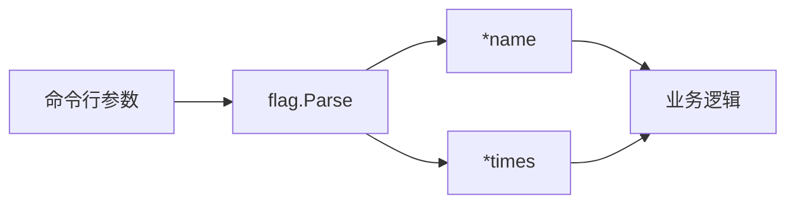
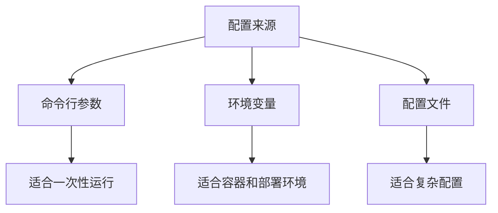

# CLI、参数和配置

Go 很适合写命令行工具。编译成单个二进制，拷到服务器上就能跑，这是 Go 在 DevOps 和基础设施领域很受欢迎的原因之一。

## 最小 CLI

```go
package main

import "fmt"

func main() {
	fmt.Println("todo-cli")
}
```

构建：

```powershell
go build -o todo.exe
.\todo.exe
```

## 使用 flag 读取参数

标准库 `flag` 可以解析命令行参数。

```go
package main

import (
	"flag"
	"fmt"
)

func main() {
	name := flag.String("name", "Go", "name to greet")
	times := flag.Int("times", 1, "repeat times")

	flag.Parse()

	for range *times {
		fmt.Println("Hello,", *name)
	}
}
```

运行：

```powershell
go run . -name Ada -times 3
```



为什么 `name` 是 `*string`？因为 `flag.String` 返回指针，解析后把值写进去。

## 读取环境变量

服务端程序经常从环境变量读配置。

```go
package main

import (
	"fmt"
	"os"
)

func main() {
	port := os.Getenv("PORT")
	if port == "" {
		port = "8080"
	}

	fmt.Println("port:", port)
}
```

PowerShell 运行：

```powershell
$env:PORT="3000"
go run .
```

## 小项目：带参数的 Todo 添加器

这个例子把标题写进 JSON 文件。

```go
package main

import (
	"encoding/json"
	"flag"
	"fmt"
	"os"
)

type Todo struct {
	ID    int    `json:"id"`
	Title string `json:"title"`
	Done  bool   `json:"done"`
}

func main() {
	file := flag.String("file", "todos.json", "todo file path")
	title := flag.String("title", "", "todo title")
	flag.Parse()

	if *title == "" {
		fmt.Println("missing -title")
		return
	}

	todos, err := loadTodos(*file)
	if err != nil {
		fmt.Println("load:", err)
		return
	}

	todo := Todo{ID: len(todos) + 1, Title: *title}
	todos = append(todos, todo)

	if err := saveTodos(*file, todos); err != nil {
		fmt.Println("save:", err)
		return
	}

	fmt.Printf("added: %+v\n", todo)
}

func loadTodos(path string) ([]Todo, error) {
	data, err := os.ReadFile(path)
	if os.IsNotExist(err) {
		return nil, nil
	}
	if err != nil {
		return nil, err
	}

	var todos []Todo
	if err := json.Unmarshal(data, &todos); err != nil {
		return nil, err
	}

	return todos, nil
}

func saveTodos(path string, todos []Todo) error {
	data, err := json.MarshalIndent(todos, "", "  ")
	if err != nil {
		return err
	}

	return os.WriteFile(path, data, 0644)
}
```

运行：

```powershell
go run . -title "Learn flag"
go run . -title "Write a tiny CLI"
```

## 日志

Go 新项目可以先用标准库 `log/slog` 写结构化日志。

```go
package main

import (
	"log/slog"
	"os"
)

func main() {
	logger := slog.New(slog.NewJSONHandler(os.Stdout, nil))
	logger.Info("server started", "port", 8080, "env", "dev")
}
```

输出是一行 JSON，适合被日志系统采集。

## CLI 参数、环境变量、配置文件怎么选



初学阶段建议：

- CLI 小工具：先用 `flag`。
- Web 服务：端口、数据库地址先用环境变量。
- 配置变复杂后，再考虑配置文件或第三方库。
