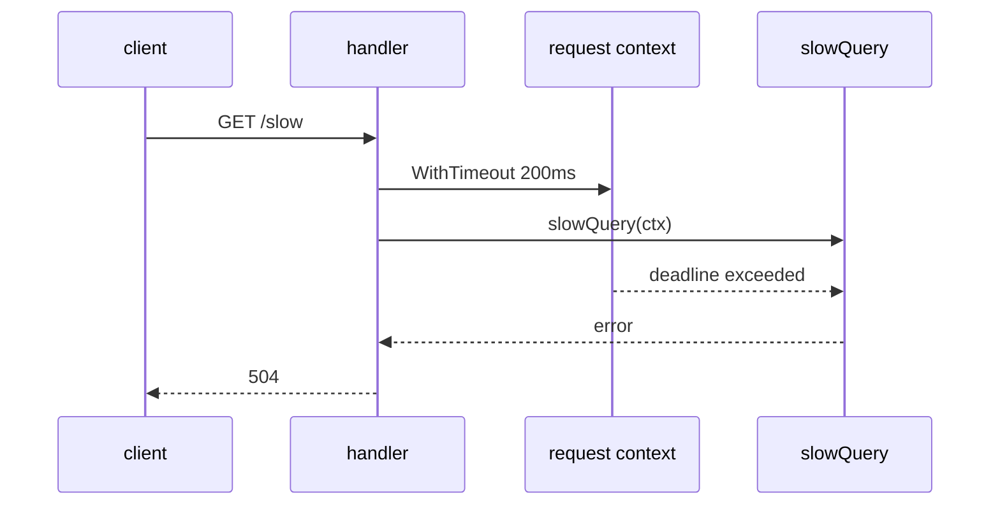
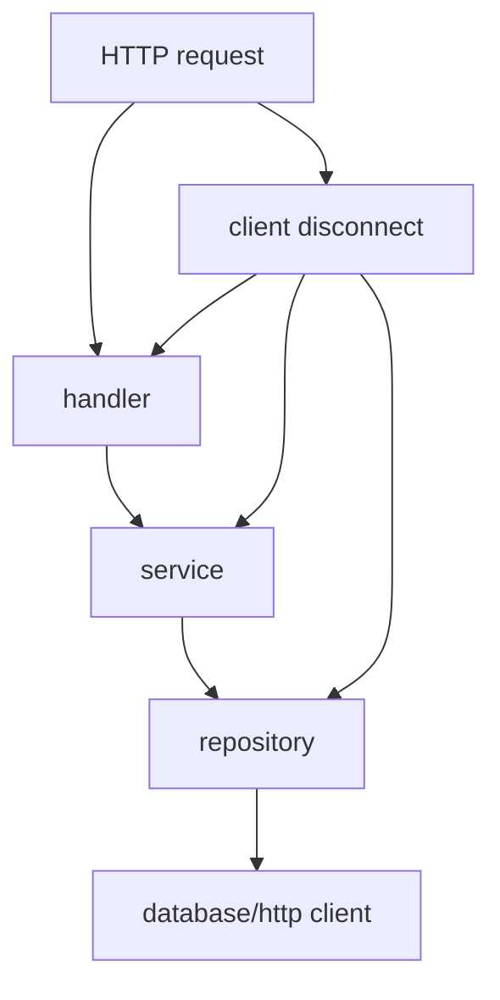

# context 在服务端里的真实用法

前面你已经见过 `context.WithTimeout`。在真实服务端里，`context.Context` 的核心作用是：**传递取消信号、超时和请求生命周期**。

## context 不是全局变量

`context` 应该作为函数第一个参数传下去：

```go
func LoadUser(ctx context.Context, id int) (User, error) {
	// use ctx
}
```

常见风格：

```go
func DoSomething(ctx context.Context, input Input) (Output, error)
```

## HTTP 请求自带 context

可运行例子：

```go
package main

import (
	"context"
	"encoding/json"
	"errors"
	"log"
	"net/http"
	"time"
)

type Response struct {
	Message string `json:"message"`
}

func main() {
	http.HandleFunc("/slow", func(w http.ResponseWriter, r *http.Request) {
		ctx, cancel := context.WithTimeout(r.Context(), 200*time.Millisecond)
		defer cancel()

		message, err := slowQuery(ctx)
		if err != nil {
			http.Error(w, err.Error(), http.StatusGatewayTimeout)
			return
		}

		w.Header().Set("Content-Type", "application/json")
		json.NewEncoder(w).Encode(Response{Message: message})
	})

	log.Println("listening on http://localhost:8080")
	log.Fatal(http.ListenAndServe(":8080", nil))
}

func slowQuery(ctx context.Context) (string, error) {
	select {
	case <-time.After(500 * time.Millisecond):
		return "query done", nil
	case <-ctx.Done():
		return "", errors.New("query timeout")
	}
}
```

访问：

```powershell
curl http://localhost:8080/slow
```

因为 handler 设置了 200ms 超时，而 `slowQuery` 要 500ms，所以会返回超时。



## 为什么不用全局 timeout

每个请求的生命周期不同：

- 客户端主动断开，请求 context 会取消。
- 网关可能有自己的超时。
- 某个数据库查询可能只允许 200ms。
- 某个后台任务可能允许 5s。

所以 Go 倾向于把 `ctx` 一层层传下去。



## 手动取消

```go
package main

import (
	"context"
	"fmt"
	"time"
)

func main() {
	ctx, cancel := context.WithCancel(context.Background())

	go func() {
		time.Sleep(100 * time.Millisecond)
		cancel()
	}()

	select {
	case <-time.After(time.Second):
		fmt.Println("done")
	case <-ctx.Done():
		fmt.Println("cancelled:", ctx.Err())
	}
}
```

## context.Value 少用

`context.Value` 可以传请求级数据，比如 trace id、用户身份。但不要把普通业务参数塞进 context。

适合：

```go
requestID := r.Context().Value("request_id")
```

不适合：

```go
ctx = context.WithValue(ctx, "user_name", "Ada")
CreateOrder(ctx)
```

普通业务参数应该显式写在函数参数里。

## 和 Rust/TS 类比

Rust 的 `tokio::select!` + `CancellationToken`：

```rust
tokio::select! {
    _ = do_work() => {}
    _ = token.cancelled() => {}
}
```

TS 的 `AbortController`：

```ts
const controller = new AbortController()
fetch(url, { signal: controller.signal })
controller.abort()
```

Go 的惯用写法：

```go
select {
case result := <-resultCh:
	return result, nil
case <-ctx.Done():
	return zero, ctx.Err()
}
```

一句话：**context 是 Go 服务端的取消令牌，不是数据仓库。**
