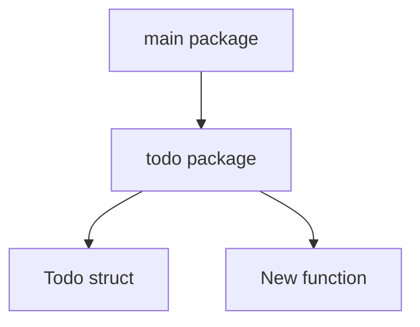
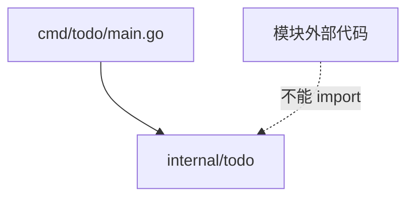
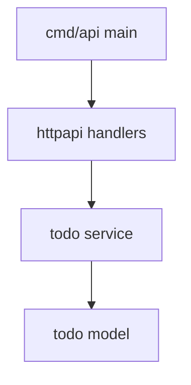

# 工程结构：从单文件到小项目

Go 项目不需要一开始就上复杂分层。最好的结构是随着复杂度自然长出来。

## 阶段 1：单文件

刚开始写练习时，这样完全可以：

```text
hello-go/
  go.mod
  main.go
```

适合：

- hello world
- 小语法实验
- 单个 HTTP demo
- 一次性脚本

## 阶段 2：按功能拆包

```text
todo/
  go.mod
  main.go
  todo/
    todo.go
```

`todo/todo.go`：

```go
package todo

type Todo struct {
	ID    int
	Title string
	Done  bool
}

func New(id int, title string) Todo {
	return Todo{ID: id, Title: title}
}
```

`main.go`：

```go
package main

import (
	"fmt"

	"example.com/todo/todo"
)

func main() {
	item := todo.New(1, "Learn project layout")
	fmt.Printf("%+v\n", item)
}
```



## 阶段 3：命令入口放到 cmd

当一个仓库里可能有多个可执行程序时，常见结构是：

```text
todo/
  go.mod
  cmd/
    todo/
      main.go
  internal/
    todo/
      todo.go
```

`cmd/todo/main.go` 是入口。

`internal/todo/todo.go` 是内部包。`internal` 有特殊含义：模块外部不能 import 它。



## internal 的意义

假设你的模块是：

```text
example.com/todo
```

那么这个包：

```text
example.com/todo/internal/store
```

只能被 `example.com/todo` 下面的代码导入，模块外部不能直接用。

这有点像 Go 用目录结构表达“私有实现”。

## 一个小型 HTTP 项目结构

```text
todo-api/
  go.mod
  cmd/
    api/
      main.go
  internal/
    todo/
      model.go
      service.go
    httpapi/
      handler.go
```

职责：

| 目录 | 职责 |
| --- | --- |
| `cmd/api` | 程序入口，组装依赖，启动服务 |
| `internal/todo` | 业务模型和业务逻辑 |
| `internal/httpapi` | HTTP handler，请求响应转换 |



## 不要一开始就过度分层

很多 Go 项目不喜欢深层目录：

```text
controllers/
services/
repositories/
entities/
dtos/
middlewares/
```

这不是不能用，而是初期容易变成“每个功能都要跳 6 个文件”。

Go 更常见的思路：

- 先按领域或功能拆。
- 入口负责组装。
- handler 负责 HTTP。
- service 负责业务。
- store/repository 负责存储。
- 复杂了再拆，不复杂就保持平。

## 包名建议

好的包名：

```text
user
todo
store
httpapi
config
```

不太推荐的包名：

```text
utils
common
helpers
models
struct
```

`utils/common/helpers` 容易变成杂物间。`struct` 是关键字，也容易造成学习阶段的混乱。

## 练习

把你现在的 `hello-go` 慢慢整理成：

```text
hello-go/
  go.mod
  main.go
  greet/
  user/
  speaker/
  async/
  calc/
```

每个包只放自己相关的内容，然后运行：

```powershell
go test ./...
go run .
```
