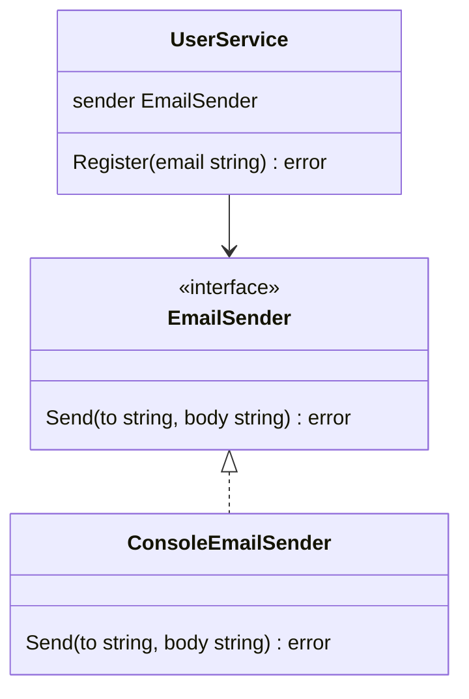
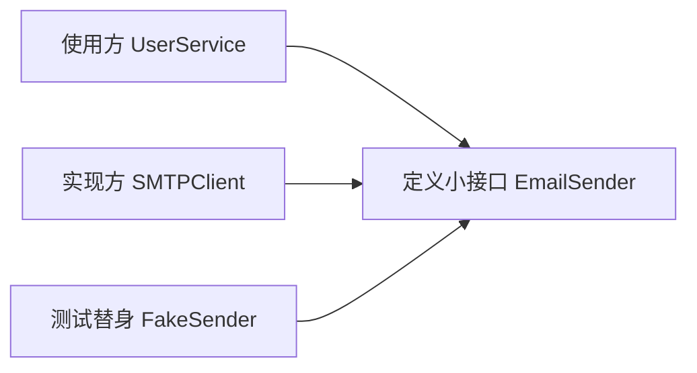

# 接口实战：依赖倒置和可测试代码

Go 的 interface 很适合让代码可测试。重点不是“先设计一大堆接口”，而是在使用方需要替换依赖时，定义一个小接口。

## 不好测试的代码

假设函数内部直接调用外部系统：

```go
func SendWelcomeEmail(email string) error {
	return realEmailClient.Send(email, "Welcome")
}
```

测试时你就很难避免真的发邮件。

## 用小接口隔离依赖

可运行例子：

```go
package main

import "fmt"

type EmailSender interface {
	Send(to string, body string) error
}

type UserService struct {
	sender EmailSender
}

func NewUserService(sender EmailSender) UserService {
	return UserService{sender: sender}
}

func (s UserService) Register(email string) error {
	return s.sender.Send(email, "Welcome")
}

type ConsoleEmailSender struct{}

func (ConsoleEmailSender) Send(to string, body string) error {
	fmt.Printf("send email to %s: %s\n", to, body)
	return nil
}

func main() {
	service := NewUserService(ConsoleEmailSender{})
	if err := service.Register("ada@example.com"); err != nil {
		fmt.Println("register:", err)
	}
}
```



## 写测试替身

`service.go`：

```go
package user

type EmailSender interface {
	Send(to string, body string) error
}

type Service struct {
	sender EmailSender
}

func NewService(sender EmailSender) Service {
	return Service{sender: sender}
}

func (s Service) Register(email string) error {
	return s.sender.Send(email, "Welcome")
}
```

`service_test.go`：

```go
package user

import "testing"

type FakeSender struct {
	To   string
	Body string
}

func (f *FakeSender) Send(to string, body string) error {
	f.To = to
	f.Body = body
	return nil
}

func TestRegisterSendsWelcomeEmail(t *testing.T) {
	fake := &FakeSender{}
	service := NewService(fake)

	if err := service.Register("ada@example.com"); err != nil {
		t.Fatal(err)
	}

	if fake.To != "ada@example.com" {
		t.Fatalf("to = %q", fake.To)
	}
	if fake.Body != "Welcome" {
		t.Fatalf("body = %q", fake.Body)
	}
}
```

运行：

```powershell
go test ./...
```

## 接口放在哪里

Go 社区常说：**接口通常由使用方定义。**

比如 `UserService` 只需要发送邮件，那么它定义：

```go
type EmailSender interface {
	Send(to string, body string) error
}
```

真实邮件客户端可以有很多方法：

```go
type SMTPClient struct{}

func (SMTPClient) Send(to string, body string) error { return nil }
func (SMTPClient) Close() error { return nil }
func (SMTPClient) Ping() error { return nil }
```

但 `UserService` 不需要知道 `Close` 和 `Ping`。



## 和 Rust/TS 类比

Rust 里会像这样：

```rust
trait EmailSender {
    fn send(&self, to: &str, body: &str) -> Result<(), Error>;
}
```

TypeScript 里：

```ts
interface EmailSender {
  send(to: string, body: string): Promise<void>
}
```

Go 的特别之处是实现是隐式的：

```go
func (SMTPClient) Send(to string, body string) error
```

只要方法对上，就满足接口，不需要写 `implements`。

## 什么时候不要用 interface

不要为了“看起来架构完整”而写接口：

```go
type UserService interface {
	CreateUser(...)
	UpdateUser(...)
	DeleteUser(...)
}
```

如果只有一个实现、也没有测试替换需求，先用具体类型更直接。

经验：

- 调用外部系统时，接口很有用。
- 测试需要替换依赖时，接口很有用。
- 只有一个实现的内部业务对象，不一定需要接口。
