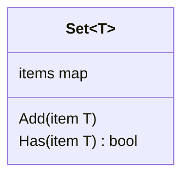
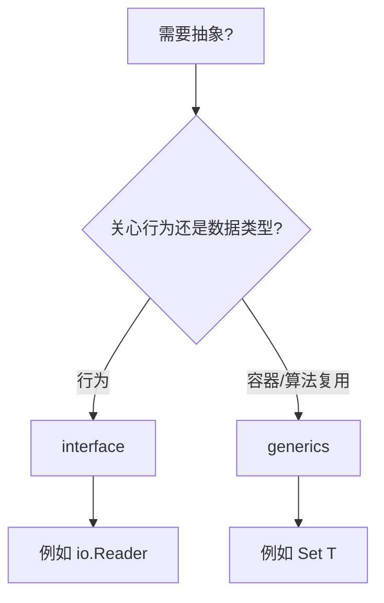

# 泛型实战：什么时候该用，什么时候别用

Go 的泛型适合写“和具体类型无关”的小工具，比如 slice 操作、集合、缓存、结果包装。它不应该变成每个业务函数都要写类型参数。

## 最简单的泛型函数

```go
package main

import "fmt"

func First[T any](items []T) (T, bool) {
	var zero T
	if len(items) == 0 {
		return zero, false
	}

	return items[0], true
}

func main() {
	name, ok := First([]string{"Ada", "Grace"})
	fmt.Println(name, ok)

	n, ok := First([]int{10, 20})
	fmt.Println(n, ok)
}
```

`T any` 表示 `T` 可以是任何类型。

```mermaid
flowchart TD
    A[First T any] --> B[[]string]
    A --> C[[]int]
    A --> D[[]User]
```

## 泛型约束

如果函数内部要使用 `+`，就不能写 `any`，因为不是所有类型都能相加。

```go
package main

import "fmt"

type Number interface {
	~int | ~int64 | ~float64
}

func Sum[T Number](items []T) T {
	var total T
	for _, item := range items {
		total += item
	}
	return total
}

func main() {
	fmt.Println(Sum([]int{1, 2, 3}))
	fmt.Println(Sum([]float64{1.5, 2.5}))
}
```

`~int` 表示底层类型是 `int` 的自定义类型也可以。

## 泛型集合 Set

```go
package main

import "fmt"

type Set[T comparable] struct {
	items map[T]struct{}
}

func NewSet[T comparable]() Set[T] {
	return Set[T]{items: make(map[T]struct{})}
}

func (s Set[T]) Add(item T) {
	s.items[item] = struct{}{}
}

func (s Set[T]) Has(item T) bool {
	_, ok := s.items[item]
	return ok
}

func main() {
	names := NewSet[string]()
	names.Add("Ada")

	fmt.Println(names.Has("Ada"))
	fmt.Println(names.Has("Grace"))
}
```

为什么约束是 `comparable`？因为 map 的 key 必须可比较。



## 什么时候该用泛型

适合：

- `First[T]`
- `Map[T, U]`
- `Filter[T]`
- `Set[T]`
- `Cache[K comparable, V any]`

不太适合：

- 业务逻辑还没重复时提前抽象。
- 为了模仿 Rust trait bound 写复杂类型约束。
- 一个函数只有一个业务类型会用。

## 泛型和 interface 怎么选



interface 抽象行为：

```go
type Reader interface {
	Read(p []byte) (int, error)
}
```

泛型抽象类型：

```go
func First[T any](items []T) (T, bool)
```

## 和 Rust/TS 类比

Rust：

```rust
fn first<T>(items: &[T]) -> Option<&T> {
    items.first()
}
```

TypeScript：

```ts
function first<T>(items: T[]): T | undefined {
  return items[0]
}
```

Go：

```go
func First[T any](items []T) (T, bool)
```

Go 没有 `Option<T>`，所以常见返回 `(T, bool)`。

## 练习

写一个泛型函数：

```go
func Filter[T any](items []T, keep func(T) bool) []T
```

目标用法：

```go
numbers := Filter([]int{1, 2, 3, 4}, func(n int) bool {
	return n%2 == 0
})
```
