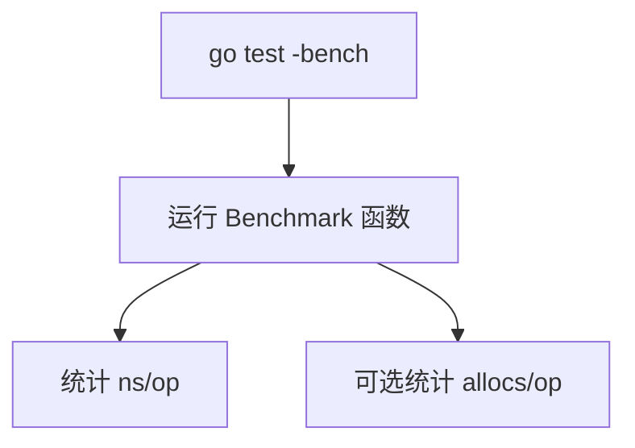
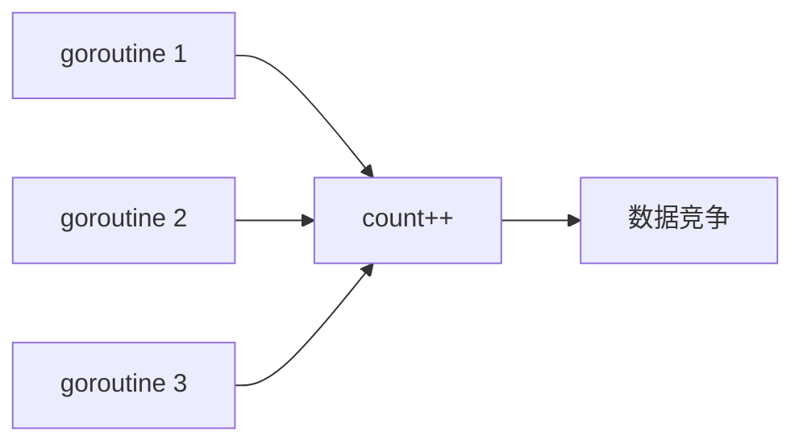
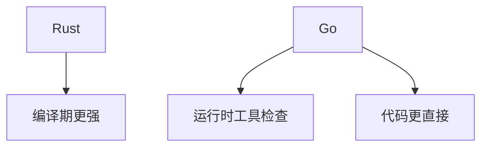
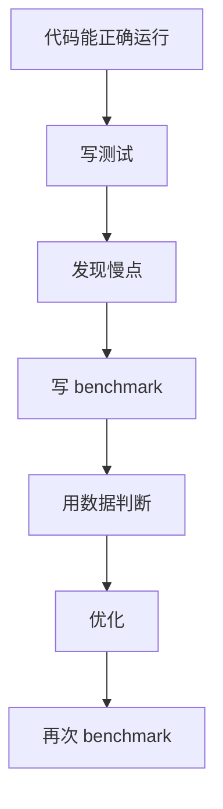

# 性能、benchmark 和 race detector

Go 的工具链很实用。你不需要先装一堆东西，就能测试、跑基准、检查数据竞争。

## benchmark 基础

新建 `concat_test.go`：

```go
package main

import (
	"strings"
	"testing"
)

func JoinPlus(items []string) string {
	result := ""
	for _, item := range items {
		result += item
	}
	return result
}

func JoinBuilder(items []string) string {
	var builder strings.Builder
	for _, item := range items {
		builder.WriteString(item)
	}
	return builder.String()
}

func BenchmarkJoinPlus(b *testing.B) {
	items := []string{"a", "b", "c", "d", "e"}
	for range b.N {
		_ = JoinPlus(items)
	}
}

func BenchmarkJoinBuilder(b *testing.B) {
	items := []string{"a", "b", "c", "d", "e"}
	for range b.N {
		_ = JoinBuilder(items)
	}
}
```

运行：

```powershell
go test -bench=.
```

查看内存分配：

```powershell
go test -bench=. -benchmem
```



## benchmark 函数规则

- 文件名以 `_test.go` 结尾。
- 函数名以 `Benchmark` 开头。
- 参数是 `b *testing.B`。
- 循环使用 `for range b.N`。

## race detector

数据竞争是并发程序里很隐蔽的问题。Go 可以用 `-race` 检查。

先看一段有问题的代码，保存为 `race_test.go`：

```go
package main

import (
	"sync"
	"testing"
)

func TestRace(t *testing.T) {
	count := 0
	var wg sync.WaitGroup

	for range 100 {
		wg.Add(1)
		go func() {
			defer wg.Done()
			count++
		}()
	}

	wg.Wait()
	t.Log(count)
}
```

运行：

```powershell
go test -race
```

你会看到数据竞争报告。原因是多个 goroutine 同时修改 `count`。



## 用 mutex 修复

```go
package main

import (
	"sync"
	"testing"
)

func TestNoRace(t *testing.T) {
	count := 0
	var mu sync.Mutex
	var wg sync.WaitGroup

	for range 100 {
		wg.Add(1)
		go func() {
			defer wg.Done()

			mu.Lock()
			count++
			mu.Unlock()
		}()
	}

	wg.Wait()

	if count != 100 {
		t.Fatalf("count = %d, want 100", count)
	}
}
```

也可以用 `defer mu.Unlock()`：

```go
mu.Lock()
defer mu.Unlock()
count++
```

在循环很热的路径里，手动 unlock 有时更直接；普通业务代码里 `defer` 更不容易忘。

## 和 Rust 的区别

Rust 很多数据竞争会在编译期被阻止：

```rust
Arc<Mutex<i32>>
Send
Sync
```

Go 不会在编译期阻止所有共享可变状态。它的组合是：

- 写代码时用 `sync.Mutex`、channel、atomic。
- 测试时用 `go test -race`。
- 代码评审时关注 goroutine 生命周期和共享变量。



## pprof 初步认识

Go 还有性能分析工具 `pprof`。现在你只需要知道它能看：

- CPU 花在哪。
- 内存分配在哪。
- goroutine 堆积在哪。

后面写 HTTP 服务时可以加：

```go
import _ "net/http/pprof"
```

然后启动调试端口。不过初学阶段先掌握 benchmark 和 `-race` 更重要。

## 性能优化顺序



不要凭感觉优化。Go 的工具链很方便，用数据说话会更稳。
