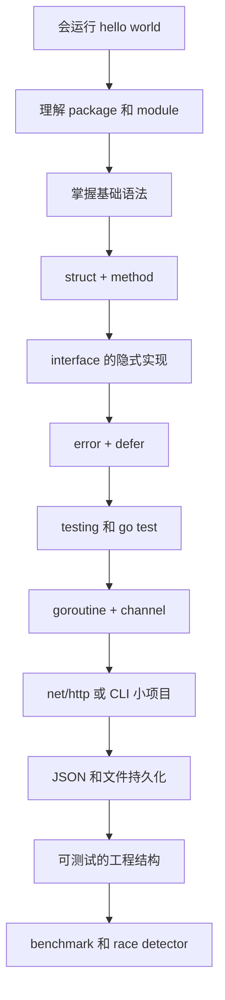

# Go 学习笔记目录

这组笔记面向已经写过 Rust 和 TypeScript 的学习者：少讲“什么是变量”这种基础概念，多讲 Go 的表达方式、工程习惯和容易混淆的地方。

建议阅读顺序：

1. [Go 是什么，适合做什么](./01-what-is-go.md)
2. [从 hello world 到项目结构](./02-project-and-modules.md)
3. [基础语法：变量、流程控制、函数](./03-basic-syntax.md)
4. [类型系统：struct、method、interface、泛型](./04-types-interfaces-generics.md)
5. [错误处理、defer 和测试](./05-errors-defer-tests.md)
6. [并发：goroutine、channel、context](./06-concurrency.md)
7. [生态系统和下一步路线](./07-ecosystem-roadmap.md)

第二阶段：

8. [JSON、文件读写和数据建模](./08-json-files-io.md)
9. [用标准库写 HTTP API](./09-http-api-net-http.md)
10. [CLI、参数和配置](./10-cli-flags-config.md)
11. [context 在服务端里的真实用法](./11-context-in-server.md)
12. [工程结构：从单文件到小项目](./12-project-layout.md)
13. [接口实战：依赖倒置和可测试代码](./13-interfaces-for-testing.md)
14. [泛型实战：什么时候该用，什么时候别用](./14-generics-practice.md)
15. [性能、benchmark 和 race detector](./15-performance-benchmark-race.md)

## 如何运行笔记里的例子

每个例子都尽量像 hello world 一样小。你可以用下面的方式临时创建一个目录来跑：

```powershell
mkdir scratch-go
cd scratch-go
go mod init example.com/scratch-go
```

然后把笔记里的完整 `main.go` 复制进去，运行：

```powershell
go run .
```

如果例子只有一个文件，也可以直接运行：

```powershell
go run main.go
```

## Go 的学习地图



## 官方资料入口

- Go 官方学习入口：https://go.dev/learn/
- Go 模块教程：https://go.dev/doc/tutorial/create-module
- Go 标准库文档：https://pkg.go.dev/std
- Go 包搜索站：https://pkg.go.dev/
- VS Code + gopls 工作区说明：https://go.dev/gopls/workspace
