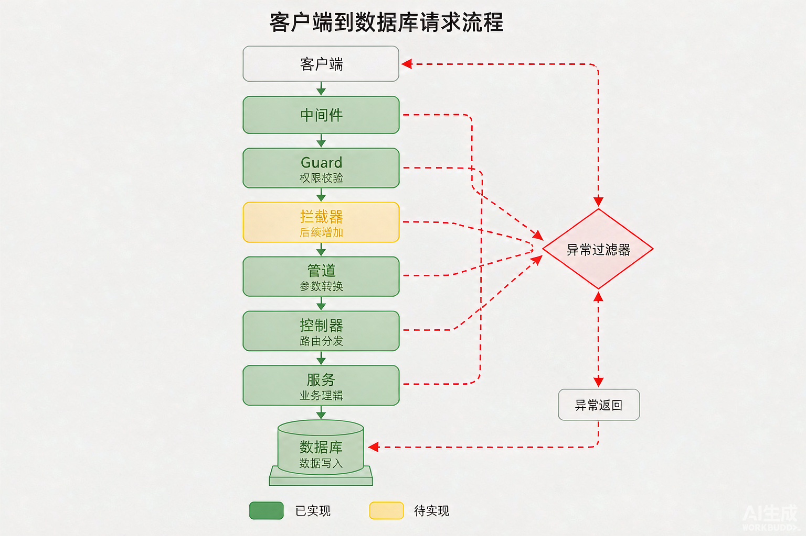
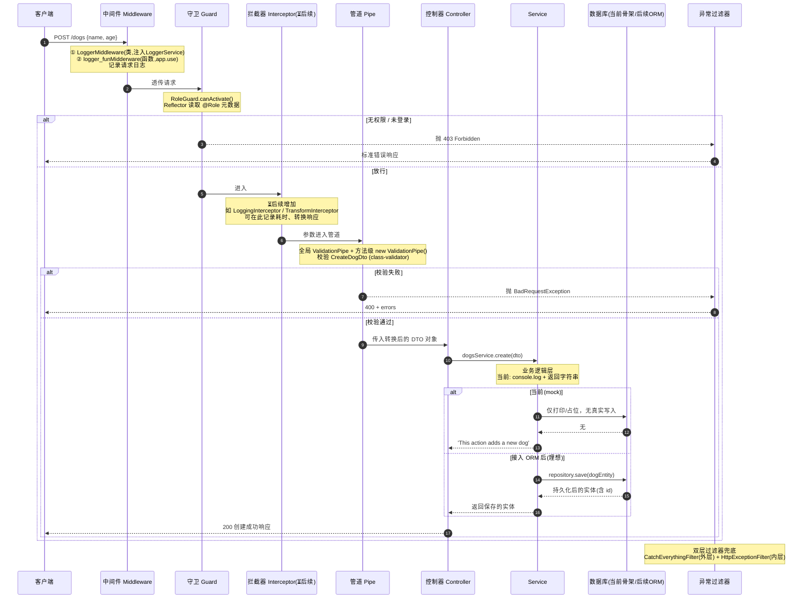

# NestJS 一次请求到「写入数据」的全流程

> 本文以一次 **`POST /dogs`**（创建一只狗）为主线，完整串联：
> **客户端请求 → 中间件 → 守卫 → 拦截器 → 管道 → 控制器 → Service → 数据库写入 → 响应**
> 并标注每个阶段在本项目中的真实状态。
>
> ⚠️ 当前项目**尚未接入真实数据库**：`DogsService.create` 仅 `console.log` + 返回字符串，`DatabaseMoudleModule` 是骨架占位。文中「写入数据」段会区分**当前（mock）** 与 **接入 ORM 后的理想链路**，避免误导。
> 🟡 拦截器在本项目中**尚未实现**，流程图中标注为「后续增加」。



---

## 一、全流程时序图（Mermaid）



---

## 二、逐阶段说明（含本项目真实状态）

| 阶段 | 触发点 | 本项目实现 | 数据/副作用 |
| --- | --- | --- | --- |
| ① 中间件 | 所有请求最前置 | `LoggerMiddleware`（类, app.module 内 exclude cats）<br/>`logger_funMidderware`（函数, main.ts `app.use()`） | 仅写日志，**不触碰业务数据** |
| ② 守卫 | 中间件之后、管道之前 | `RoleGuard`（全局 APP_GUARD + DogsController 控制器级） | 决定**是否放行**，失败抛 403 → 进过滤器 |
| ③ 拦截器 | 守卫之后、管道之前 | ⏳ 后续增加（`APP_INTERCEPTOR`） | 理想用途：记录耗时、统一响应包裹、缓存 |
| ④ 管道 | 控制器方法参数进入前 | 全局 `ValidationPipe` + dogs `create` 方法级 `new ValidationPipe()` | **校验/转换入参**，失败抛 400 → 进过滤器 |
| ⑤ 控制器 | 路由匹配后 | `DogsController.create(@Body(new ValidationPipe()) dto)` | 接收干净 DTO，调用 Service |
| ⑥ Service | 被控制器调用 | `DogsService.create()` | 业务逻辑；**当前未写库**，仅打印 |
| ⑦ 数据库写入 | Service 内 | `DatabaseMoudleModule` 为骨架（`DATABASE_CONNECTION` 占位） | 当前无真实写入；接入 ORM 后由 repository 完成 |
| ⑧ 响应 | 返回客户端 | 控制器返回值 → 拦截器(若有) → 客户端 | 成功 200 / 失败走过滤器 |

---

## 三、异常处理贯穿全流程

管道、守卫、控制器、Service 任意阶段抛出的异常，都会被**异常过滤器**统一捕获：

```mermaid
flowchart LR
    A[守卫抛 403] --> EF
    B[管道抛 400] --> EF
    C[Service/未知异常] --> EF
    EF[HttpExceptionFilter(内层)<br/>CatchEverythingFilter(外层)] --> R[标准错误响应 JSON]
```

- `HttpExceptionFilter`：处理已知 `HttpException`（如 400/403/404），返回结构化的 `statusCode/message`；
- `CatchEverythingFilter`：兜底所有非 HttpException（如数据库报错、空指针），统一返回 500。

> 注意嵌套顺序：外层过滤器（`CatchEverythingFilter`）先注册、后执行，内层（`HttpExceptionFilter`）先注册、先执行，二者配合实现「已知错误精细处理 + 未知错误兜底」。

---

## 四、当前 mock vs 接入 ORM 后的写入差异

```mermaid
flowchart TD
    CT[Controller.create] --> SV[DogsService.create]
    SV --> S1{是否已接入 ORM?}
    S1 -->|当前 mock| M[console.log(dto)<br/>return 'This action adds a new dog']
    S1 -->|接入后| O[dogRepository.save(entity)<br/>写入真实数据库<br/>return savedEntity]
    M --> RES[200 响应]
    O --> RES
```

**接入真实数据库时需要的改动（学习路线）：**
1. `DatabaseMoudleModule.forRoot(entities, options)` 内用 `useFactory` 建立 TypeORM / Mongoose 连接；
2. 为每个实体（如 `DogEntity`）生成 repository provider（`getRepositoryToken`）；
3. `DogsService` 注入 `DATABASE_CONNECTION` 或对应 repository，把 `create()` 改为 `save()`；
4. `CreateDogDto` 与实体字段对齐，必要时用 `class-transformer` 做 DTO→Entity 映射。

---

## 五、如何随学习进度更新本图

- **实现拦截器**：把流程图中 `IC` 节点的 `⏳后续增加` 去掉，补充具体拦截逻辑说明；
- **接入数据库**：把「四、当前 mock vs 接入 ORM」的 mock 分支删除或降级为注释，主流程直接走 `repository.save`；
- **新增异常类型**：在「三、异常处理」flowchart 增加分支即可；
- 所有图均为 Mermaid 文本，改文本即更新，无需重画。

> 本文与《NestJS学习架构图.md》互补：本文聚焦「一次请求到写入」的纵向时间线，架构图聚焦「各机制挂载位置」的横向分层。
