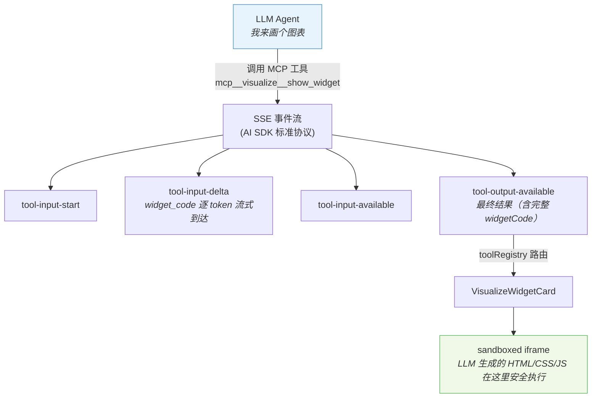
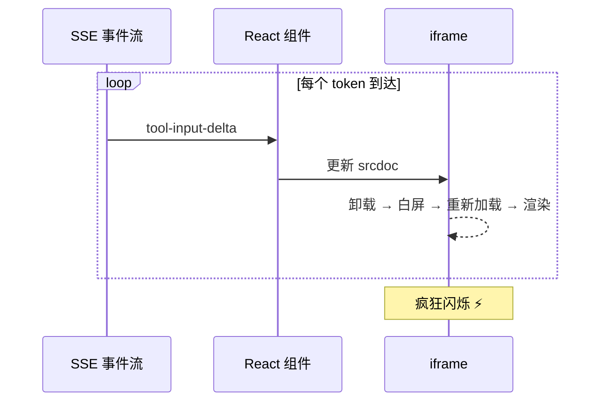
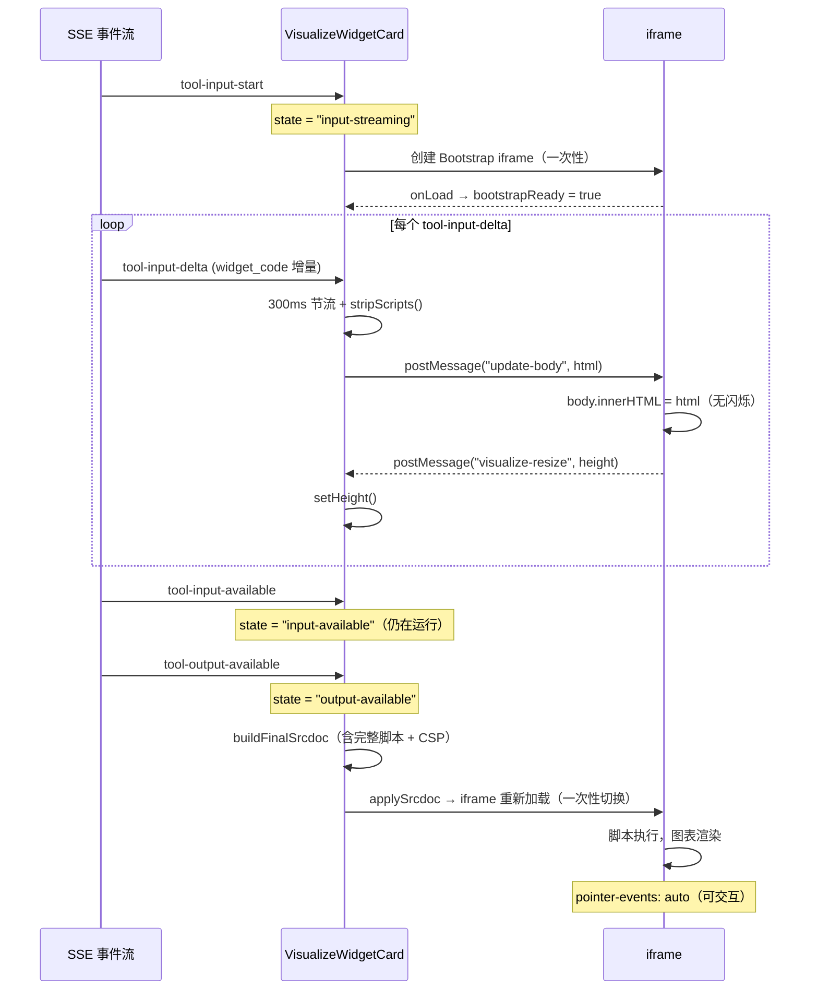
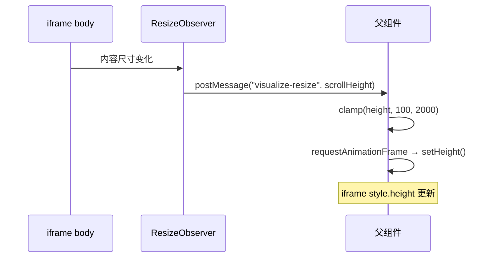
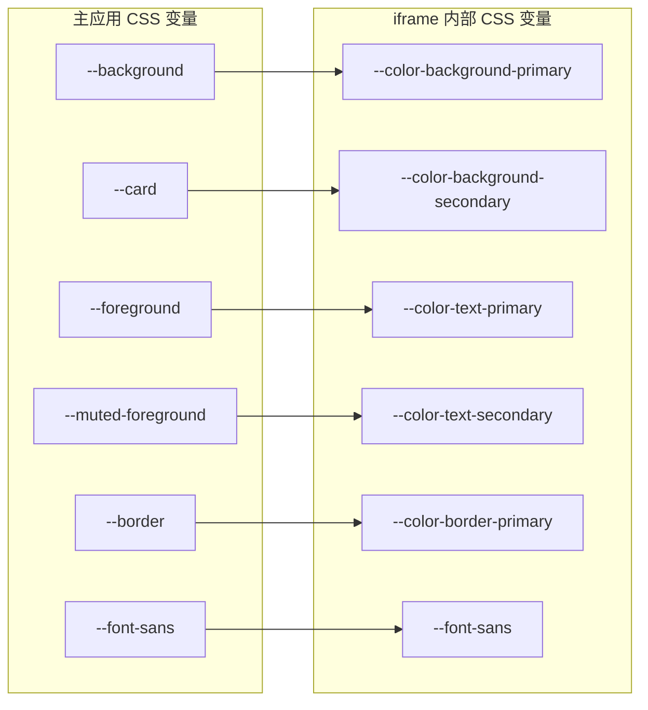
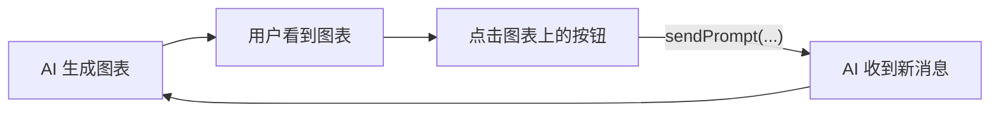
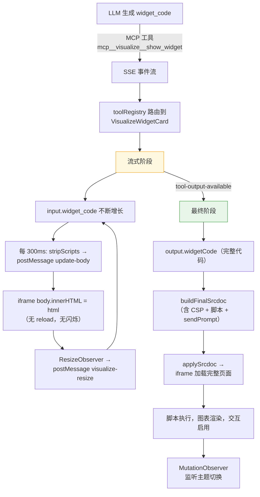

# 在聊天消息中流式渲染图表：iframe 沙箱 + postMessage 的实现方案

> 在 EdgeMind Studio 中，AI Agent 可以通过 MCP 工具生成可交互的图表和可视化 Widget。这些 Widget 本质上是 LLM 生成的完整 HTML/CSS/JS 代码，需要在聊天消息流中安全地实时渲染。本文详细拆解这套"流式渲染 + iframe 沙箱"的实现思路，包括两阶段渲染策略、安全隔离、主题同步、双向通信等关键细节。

## 需求场景

聊天场景中，AI Agent 有时需要展示数据图表、仪表盘、交互式可视化等富内容。这些内容不是静态图片，而是完整的 HTML + CSS + JS 代码（可能引用 ECharts、D3.js 等库）。需要解决：

1. **流式预览** — LLM 逐 token 生成代码，用户应该能边生成边看到效果，而非等全部完成
2. **安全隔离** — LLM 生成的代码不可信，不能让它访问主应用的 DOM、Cookie、Store 等
3. **自适应高度** — Widget 高度不固定，iframe 需要随内容自动撑开
4. **主题适配** — Widget 需要自动跟随主应用的 dark/light 主题
5. **双向通信** — Widget 内部的按钮可以向 AI 发送新消息（如"帮我分析这个数据点"）

---

## 整体架构



### 数据类型定义

```typescript
// 工具输入：LLM 生成的参数
interface VisualizeWidgetInput {
  title: string;           // 图表标题
  widget_code: string;     // 完整 HTML+CSS+JS 代码
  loading_messages?: string[];
}

// 工具输出：后端执行后返回
interface VisualizeWidgetOutput {
  success: boolean;
  widgetId: string;
  title: string;
  widgetCode: string;      // 最终完整代码
  loadingMessages?: string[];
  modules?: string[];
}
```

### 工具路由

前端通过 `toolRegistry` 将 toolName 映射到对应的渲染组件：

```typescript
export const toolRegistry: Record<string, ToolUIRendererComponent> = {
  WebSearch: WebSearchCard,
  Write: WriteCard,
  // ... 其他工具
  mcp__visualize__show_widget: VisualizeWidgetCard,  // ← 这里
};
```

当 SSE 流中出现 `toolName === "mcp__visualize__show_widget"` 的事件时，前端自动使用 `VisualizeWidgetCard` 来渲染。

---

## 核心设计：两阶段渲染

这是整个方案最关键的设计决策。Widget 渲染分为两个阶段，解决了流式场景下 iframe 闪烁的问题。

### 问题：为什么不能直接用 srcdoc？

最直观的做法是每次收到新的 `widget_code` 增量，就更新 iframe 的 `srcdoc`：

```tsx
// 反面示例 — 每次更新 srcdoc 会导致 iframe 重新加载
<iframe srcdoc={`<html><body>${widgetCode}</body></html>`} />
```

这会导致：



### 解决方案：Bootstrap + postMessage

```mermaid
flowchart LR
    subgraph phase1 ["阶段 1: 流式（Streaming）"]
        direction TB
        B1["Bootstrap iframe (空壳)"]
        B2["只加载一次"]
        B3["监听 postMessage"]
        B4["接收 HTML 更新 body"]
        B5["脚本被 strip 掉"]
        B6["pointer-events: none"]
    end

    subgraph phase2 ["阶段 2: 最终（Final）"]
        direction TB
        F1["Final iframe (完整)"]
        F2["全新 srcdoc"]
        F3["含 script 标签"]
        F4["CSP 安全策略"]
        F5["可交互 sendPrompt"]
        F6["pointer-events: auto"]
    end

    phase1 -->|"tool-output-available"| phase2

    style phase1 fill:#fff8e1,stroke:#f9a825
    style phase2 fill:#e8f5e9,stroke:#43a047
```



### 阶段 1：Bootstrap iframe — 无闪烁流式预览

iframe 只加载一次，内部是一个极简的"空壳"页面：

```html
<!DOCTYPE html>
<html class="light">
<head>
  <style>/* 主题 CSS 变量 + 基础样式 */</style>
  <script>
    // 监听来自父窗口的消息
    window.addEventListener('message', function(e) {
      if (e.data.type === 'update-body') {
        document.body.innerHTML = e.data.html;  // 直接替换 body
        reportHeight();                         // 汇报新高度
      }
    });

    function reportHeight() {
      var h = document.documentElement.scrollHeight;
      window.parent.postMessage({ type: 'visualize-resize', height: h }, '*');
    }

    // 内容变化时自动上报高度
    new ResizeObserver(reportHeight).observe(document.body);
  </script>
</head>
<body></body>  <!-- 初始为空，等待 postMessage 填充 -->
</html>
```

父组件通过 postMessage 将流式到达的 HTML 片段推送给 iframe：

```typescript
// 300ms 节流，避免更新过于频繁
const STREAM_THROTTLE_MS = 300;

useEffect(() => {
  if (!isStreaming || !streamingWidgetCode) return;
  if (streamTimerRef.current !== null) return;

  streamTimerRef.current = setTimeout(() => {
    streamTimerRef.current = null;
    const iframe = iframeRef.current;
    if (!iframe?.contentWindow) return;

    // 跳过内容没变的情况
    if (streamingWidgetCode === lastStreamCodeRef.current) return;
    lastStreamCodeRef.current = streamingWidgetCode;

    // 关键：去掉 <script> 标签，只发 HTML + CSS
    const stripped = stripScripts(streamingWidgetCode);
    iframe.contentWindow.postMessage(
      { type: "update-body", html: stripped },
      "*"
    );
  }, STREAM_THROTTLE_MS);
}, [isStreaming, streamingWidgetCode]);
```

**为什么要 `stripScripts()`？**

```typescript
function stripScripts(code: string): string {
  // 移除完整的 <script>...</script> 标签
  let result = code.replace(/<script[\s\S]*?<\/script>/gi, "");
  // 移除未闭合的 <script>（流式中可能出现半截标签）
  const unclosed = result.match(/<script(?:\s|>)/i);
  if (unclosed?.index !== undefined) {
    result = result.slice(0, unclosed.index);
  }
  return result;
}
```

流式阶段 strip 脚本有两个原因：
1. **避免重复执行** — 每次 innerHTML 更新都会重新执行脚本，导致图表重复初始化
2. **避免半截脚本报错** — 流式到达时脚本可能只有一半，执行会报语法错误

用户看到的效果是：**HTML 结构和 CSS 样式边生成边出现（类似打字机效果），但没有 JS 执行**。

### 阶段 2：Final iframe — 完整功能渲染

当 `tool-output-available` 事件到达，拿到完整的 `widgetCode` 后，构建一个全新的 srcdoc 替换 iframe：

```html
<!DOCTYPE html>
<html class="light">
<head>
  <meta charset="utf-8">
  <!-- CSP 安全策略：只允许从白名单 CDN 加载脚本 -->
  <meta http-equiv="Content-Security-Policy"
    content="default-src 'none';
             script-src 'unsafe-inline' https://cdnjs.cloudflare.com
                        https://esm.sh https://cdn.jsdelivr.net https://unpkg.com;
             style-src 'unsafe-inline';
             img-src data: blob: https:;
             font-src https://cdnjs.cloudflare.com https://cdn.jsdelivr.net;
             connect-src 'none';">
  <style>/* 主题 CSS 变量 + 基础样式 */</style>
</head>
<body>
  ${widgetCode}  <!-- LLM 生成的完整代码，含 <script> -->

  <script>
    // 自动上报高度
    function reportHeight() {
      var height = document.documentElement.scrollHeight;
      window.parent.postMessage({ type: 'visualize-resize', height: height }, '*');
    }
    new ResizeObserver(reportHeight).observe(document.body);
    window.addEventListener('load', reportHeight);

    // 暴露 sendPrompt：Widget 内部可以调用这个函数向 AI 发消息
    window.sendPrompt = function(text) {
      if (typeof text === 'string' && text.trim().length > 0) {
        window.parent.postMessage({ type: 'visualize-send-prompt', text: text }, '*');
      }
    };
  </script>
</body>
</html>
```

这时脚本可以完整执行 — ECharts 图表渲染、D3 动画启动、交互事件绑定等。

### 阶段切换的完整时序



---

## 安全隔离

LLM 生成的代码不可信，安全是重中之重。

### iframe sandbox

```tsx
<iframe
  ref={iframeRef}
  sandbox="allow-scripts"  // 只允许脚本执行
  // 没有 allow-same-origin → 无法访问父页面 DOM、Cookie、localStorage
  // 没有 allow-forms → 无法提交表单
  // 没有 allow-top-navigation → 无法导航父页面
/>
```

### Content Security Policy

Final 阶段的 CSP 策略：

| 指令 | 值 | 说明 |
|------|-----|------|
| `default-src` | `'none'` | 默认禁止一切 |
| `script-src` | `'unsafe-inline'` + 4 个 CDN | 允许内联脚本 + 白名单 CDN |
| `style-src` | `'unsafe-inline'` | 允许内联样式 |
| `img-src` | `data: blob: https:` | 允许图片 |
| `font-src` | 2 个 CDN | 允许加载字体 |
| `connect-src` | `'none'` | **禁止所有网络请求** |

`connect-src: 'none'` 是关键 — Widget 内部无法发起 fetch/XHR/WebSocket 请求，杜绝了数据泄露风险。

### 流式阶段的额外保护

| 措施 | 说明 |
|------|------|
| `stripScripts()` | 流式阶段完全移除 `<script>` 标签 |
| `pointer-events: none` | 流式阶段禁止用户交互，防止点击半成品 UI |
| innerHTML 替换 | 不是 `appendChild`，每次都是全量替换，不会累积脏状态 |

---

## 自适应高度

iframe 默认不会根据内容自动调整高度。我们通过 postMessage 实现了自适应：



父组件用 `requestAnimationFrame` 合并高频 resize 事件：

```typescript
useEffect(() => {
  let rafId: number | null = null;
  let pendingHeight: number | null = null;

  const handler = (event: MessageEvent) => {
    if (event.source !== iframeRef.current?.contentWindow) return;

    if (event.data?.type === "visualize-resize") {
      const h = event.data.height;
      if (typeof h !== "number" || Number.isNaN(h)) return;
      pendingHeight = Math.min(Math.max(h, MIN_HEIGHT), MAX_HEIGHT);
      if (rafId === null) {
        rafId = requestAnimationFrame(() => {
          if (pendingHeight !== null) setHeight(pendingHeight);
          pendingHeight = null;
          rafId = null;
        });
      }
    }
  };

  window.addEventListener("message", handler);
  return () => {
    window.removeEventListener("message", handler);
    if (rafId !== null) cancelAnimationFrame(rafId);
  };
}, []);
```

高度限制在 `[100, 2000]` 之间，防止恶意代码通过极端高度值攻击页面布局。

---

## 主题同步

Widget 需要自动适配主应用的 dark/light 模式。实现方式是将主应用的 CSS 变量"翻译"成 iframe 内部的变量：



```typescript
const THEME_VAR_MAP: [iframeVar: string, projectVar: string, fallback: string][] = [
  ["--color-background-primary", "--background", "#ffffff"],
  ["--color-text-primary", "--foreground", "#000000"],
  // ... 更多映射
];

function readThemeVars(): Record<string, string> {
  const style = getComputedStyle(document.documentElement);
  const result: Record<string, string> = {};
  for (const [iframeVar, projectVar, fallback] of THEME_VAR_MAP) {
    result[iframeVar] = style.getPropertyValue(projectVar).trim() || fallback;
  }
  return result;
}
```

为什么要"翻译"而不是直接透传？因为 iframe 被 sandbox 隔离，无法读取父页面的 CSS 变量。我们在构建 srcdoc 时将变量值**内联写入** `:root` 样式：

```css
:root {
  --color-background-primary: oklch(1 0 0);
  --color-text-primary: oklch(0.141 0.005 285.823);
  /* ... */
}
```

### 监听主题切换

当用户在主应用中切换 dark/light 模式时，`<html>` 的 class 会变化。通过 MutationObserver 监听并重新渲染：

```typescript
useEffect(() => {
  if (!finalWidgetCode) return;
  const observer = new MutationObserver(() => {
    // class 变了（dark ↔ light），重新构建 srcdoc
    requestAnimationFrame(() => {
      buildAndApplyFinal(finalWidgetCode, iframeRef);
    });
  });
  observer.observe(document.documentElement, {
    attributes: true,
    attributeFilter: ["class"],
  });
  return () => observer.disconnect();
}, [finalWidgetCode]);
```

---

## 双向通信：Widget → AI 对话

Widget 内部可以通过 `window.sendPrompt()` 向 AI 发送新消息。例如一个图表上的"分析这个数据点"按钮：

```html
<!-- Widget 内部的代码（LLM 生成） -->
<button onclick="sendPrompt('请分析 2024 年 Q3 的销售下降原因')">
  分析这个数据点
</button>
```

`sendPrompt` 是 Final srcdoc 中注入的全局函数：

```javascript
// iframe 内部
window.sendPrompt = function(text) {
  window.parent.postMessage({ type: 'visualize-send-prompt', text: text }, '*');
};
```

父组件接收消息后调用 chatHelpers 发送：

```typescript
if (type === "visualize-send-prompt") {
  const text = event.data.text;
  if (typeof text === "string" && text.trim().length > 0) {
    chatHelpers.sendMessage({
      role: "user",
      text: text.slice(0, MAX_PROMPT_LENGTH),  // 限制 1000 字符
    });
  }
}
```

这实现了 Widget 与 AI 对话的闭环：



---

## 避免 srcdoc 重复设置的技巧

直接设置 `iframe.srcdoc = newValue` 在某些浏览器中，如果新值与旧值"看起来一样"（字符串相等），可能不会触发重新加载。我们用了一个小技巧强制刷新：

```typescript
function applySrcdoc(iframe: HTMLIFrameElement, srcdoc: string) {
  iframe.removeAttribute("srcdoc");   // 先移除
  void iframe.offsetHeight;           // 强制 reflow
  iframe.setAttribute("srcdoc", srcdoc);  // 再设置
}
```

`void iframe.offsetHeight` 触发同步 reflow，确保浏览器感知到 srcdoc 的"移除-添加"变化。

---

## 加载状态与错误处理

### 进度条 + Shimmer

```
流式阶段：顶部绿色进度条（持续动画，表示正在生成）
最终阶段：全屏 shimmer 效果（等待 iframe 加载完成后消失）
加载超时：显示"Widget 加载失败" + 重试按钮
```

```tsx
{/* 绿色进度条 — 流式阶段 */}
{isToolRunning && (
  <div className="absolute top-8.25 left-0 right-0 z-10 h-0.5 overflow-hidden">
    <div className="visualize-progress-bar h-full w-full" />
  </div>
)}

{/* Shimmer — 仅最终渲染阶段 */}
{!!finalWidgetCode && iframeLoading && (
  <div className="pointer-events-none absolute inset-0 top-8.25 z-[9]">
    <div className="absolute inset-0 visualize-shimmer-band" />
  </div>
)}
```

### 超时处理

```typescript
const LOAD_TIMEOUT = 10_000;  // 10 秒

useEffect(() => {
  if (!finalWidgetCode || !iframeLoading) return;
  const timer = setTimeout(() => setLoadError(true), LOAD_TIMEOUT);
  return () => clearTimeout(timer);
}, [finalWidgetCode, iframeLoading]);
```

---

## 完整数据流总结



---

## 关键设计决策回顾

| 决策 | 为什么 |
|------|--------|
| iframe 而非 dangerouslySetInnerHTML | 安全隔离，LLM 代码无法访问主应用 |
| Bootstrap + postMessage 而非频繁换 srcdoc | 避免流式阶段白屏闪烁 |
| 流式阶段 strip 脚本 | 防止重复执行和半截脚本报错 |
| 300ms 节流 | 平衡实时性和渲染性能 |
| CSP 白名单 + connect-src: none | 允许 CDN 库加载，禁止网络请求 |
| 变量映射而非直接透传 | sandbox iframe 无法读取父页面 CSS 变量 |
| replaceState 式的 srcdoc 刷新技巧 | 确保浏览器感知 srcdoc 变化 |
| requestAnimationFrame 合并 resize | 避免高频 setHeight 导致卡顿 |
| height 限制 [100, 2000] | 防止恶意代码攻击页面布局 |
| sendPrompt 长度限制 1000 字符 | 防止 Widget 发送超长文本 |

## 可复用的模式

这套方案的核心模式 — **"Bootstrap iframe + postMessage 流式更新 + Final srcdoc 完整渲染"** — 可以应用于任何需要在 Web 应用中安全渲染不可信 HTML 的场景：

- AI 生成的代码预览（如 Artifacts、代码沙箱）
- 用户自定义的 Widget/Dashboard
- 第三方内容嵌入
- 邮件 HTML 预览

关键是理解两个阶段各自的职责：**流式阶段负责"快速预览"（只看结构），最终阶段负责"完整功能"（脚本执行 + 交互）**。
